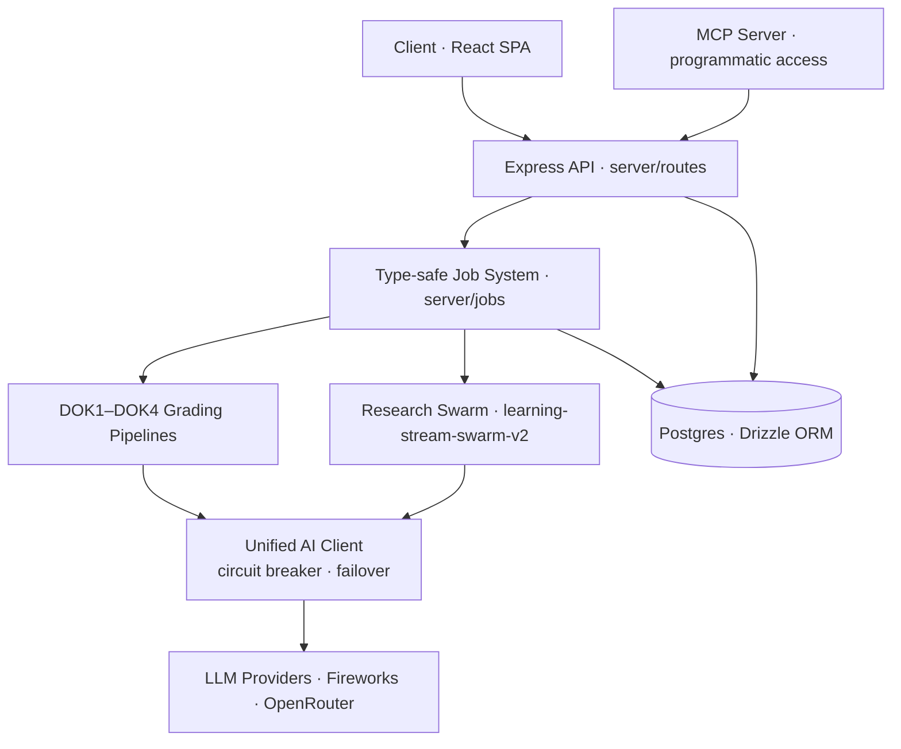

# Keystone

An AI learning platform that turns students into experts by making them do the thinking.
Shared publicly with Alpha School's permission as a portfolio reference.
**View-only — all rights reserved. See [LICENSE](LICENSE).**

## ▶ If you're evaluating my agent / AI-infrastructure work, start here

This README is comprehensive; the strongest engineering is deep inside it. These are the fastest paths to the parts worth your five minutes:

- **Multi-agent research swarm** — orchestrator, per-agent cost tracking, streamed events: [`server/ai/learning-stream-swarm-v2/`](server/ai/learning-stream-swarm-v2)
- **Unified AI client** — provider-agnostic model calls with a **circuit breaker** and **automatic failover**: [`server/ai/client/`](server/ai/client) · [`circuit-breaker.ts`](server/ai/client/circuit-breaker.ts) · [`registry.ts`](server/ai/client/registry.ts)
- **MCP server** — programmatic access to the platform for external agents: [`server/ai/learning-stream-swarm/mcp-server.ts`](server/ai/learning-stream-swarm/mcp-server.ts)
- **Type-safe background job system** — the DOK1–DOK4 grading pipelines and research jobs: [`server/jobs/`](server/jobs)
- **Skills & tool registry** — runtime-loadable skills exposed to the chat agent: [`server/ai/chat/skills.ts`](server/ai/chat/skills.ts) · [`server/ai/chat/tools/`](server/ai/chat/tools)
- **Grader evaluation & monitoring** — how I keep the LLM graders honest (frozen corpus, weekly consistency, drift tracking): [How I Know the Graders Work](#how-i-know-the-graders-work)

**System at a glance:**



---

## How I Know the Graders Work

Grading students with an LLM is only trustworthy if the grader itself is measured. These mechanisms are in the codebase to keep the graders honest:

- **Frozen monitoring corpus (5 documents)** — a fixed set of five brainlifts is snapshotted and re-graded against an unchanging baseline: [`freeze-grader-monitoring-set.ts`](server/services/freeze-grader-monitoring-set.ts)
- **Weekly dual-pass consistency run** — the frozen set is graded twice and the passes compared with a Pearson correlation per DOK level; a direct grader-stability metric, scheduled in the [`crontab`](server/jobs/crontab): [`run-weekly-grader-consistency.ts`](server/jobs/run-weekly-grader-consistency.ts)
- **Week-over-week model-drift tracking** — each run is diffed against the prior week's, so a model/provider swap that shifts grading gets caught (`/api/analytics/model-drift`)
- **Human-override recording** — human verification outcomes logged against LLM grades with a stability baseline for calibration: [`analytics-dashboard.ts`](server/storage/analytics-dashboard.ts)
- **Append-only score-event history** — score events recorded with their triggers across pipeline checkpoints: [`analytics-score-events.ts`](server/services/analytics-score-events.ts)
- **LLM divergence check** — DOK4 positions graded against a baseline model's output; an eval technique in itself: [`dok4Grader.ts`](server/ai/dok4Grader.ts)
- **Import-pipeline integrity** — every extraction validated for content loss and hallucinations against hard thresholds before acceptance: [`preformat/validator.ts`](server/ai/preformat/validator.ts)
- **313 test files** (Vitest): [`vitest.config.ts`](vitest.config.ts)

---

Keystone is built on the principle that knowledge only counts when it passes through the student's own mind. Most AI tools do the thinking for the learner. Keystone deliberately refuses to. It acts as a Socratic guide: it surfaces the raw material, asks questions that force students to articulate their own understanding, and then rigorously grades the depth of what they produce.

Each student builds a Keystone Document, a personal, source-grounded body of knowledge organized into the four levels of Depth of Knowledge (DOK): verifiable facts, their own synthesis, cross-source insight, and, finally, a defensible point of view on questions where even experts disagree. Along the way, the platform surfaces relevant sources through multi-agent research, verifies facts against evidence, grades synthesis quality, and coaches the student always through questions, never by handing over answers from raw curiosity to earned expertise.

### The Keystone Document Methodology

A Keystone Document is a personal knowledge structure organized by Depth of Knowledge. The DOK framework defines four levels, and the platform enforces a critical bright line between them:

| Level | What It Is | Who Creates It | Platform Role |
|-------|-----------|----------------|---------------|
| **DOK1 — Facts** | Objective, verifiable claims extracted from sources. Same for anyone who reads the material. | User extracts, AI assists | Verification, scoring, evidence fetching |
| **DOK2 — Summaries** | The user's own synthesis of DOK1 facts — reorganized through their interpretive lens and connected to their Keystone Document's purpose. | User writes, no AI generation | Grading (did the reorganization happen?), source verification |
| **DOK3 — Insights** | Surprising, contrarian patterns that transcend multiple sources. Subjective, supported by DOK1-2. | User only | Developed through guided Socratic discussion, graded through the full pipeline *(deepened on the roadmap by the Honcho learner profile + Adversary Defense)* |
| **DOK4 — Convictions** | Clear positions on topics where experts disagree. New knowledge that AI doesn't already have. | User only | Graded for divergence from a baseline LLM *(stress-testing via Adversary Defense + Honcho longitudinal tracking are roadmap)* |

The bright line: **DOK1-2 are based on the external world. DOK3-4 are based on the owner's expertise.** The platform's job is to surface the external world (Learning Stream), help the user extract and verify DOK1 facts, grade their DOK2 synthesis, and develop and stress-test their DOK3-4 positions — but never to generate the knowledge itself. The user must articulate it. This is the core design constraint that drives every AI interaction in the system.

DOK3 grading is built as a full pipeline, not a standalone rubric — because DOK3 thinking can't be evaluated in isolation. It has to be developed and then stress-tested. The **Discussion Agent** trains the critical-thinking muscle every session, and the grading pipeline scores an insight against the reasoning the student actually articulated rather than judging text in a vacuum. Two further layers are designed to deepen this — the **Honcho** learner profile (a longitudinal memory of *how* a student arrived at an insight) and the **AI Adversary Defense** (proving they own it under pressure). Both are documented in full below and marked

DOK4 sits at the top of the pyramid, and its grading asks a question no rubric elsewhere does: **is this position genuinely the student's own, and is it divergent enough to matter?** A Conviction is a clear, defensible stance on a question where informed people disagree, and the pipeline tests it two ways at once. It catches *borrowed divergence* — a position that merely restates a source's contrarian take was never the student's — and it runs a **divergence test**: the same question is posed to a baseline LLM with no context, and if that vanilla model reaches the student's conclusion with confidence, the position isn't divergent, it's conventional wisdom the AI already holds. A DOK4 scores high only when it commits where the baseline hedges. This is the platform's sharpest idea — it grades a student's thinking against what a machine would say, rewarding precisely the original, defensible judgment that AI can't manufacture.

Below the Keystone Document sits the **Learning Stream** — the automated discovery layer. The Learning Stream research swarm, content extraction, and discussion agents all serve the same purpose: they expose the user to the flow of relevant information so the user can curate their Keystone Document. 

---

## How a Student Uses Keystone

A single arc, start to finish:

1. **Start with a question.** A student names something they want to become expert in — a market, a thesis, a domain problem — and the agent helps them frame a *purpose* for their Keystone Document. No blank-page overwhelm.
2. **Gather the raw material.** The Learning Stream's multi-agent research swarm fans out and surfaces real sources — articles, papers, transcripts — tailored to that purpose. Nothing is summarized for them yet.
3. **Extract verified facts (DOK1).** Reading a source in the split-screen reader, the student pulls out specific, checkable facts. Each is verified against evidence in the background and scored.
4. **Synthesize in their own words (DOK2).** The Discussion Agent asks how the facts connect. The student writes the synthesis; the grader checks whether real reorganization happened — not just compression.
5. **Find the insight (DOK3).** Across sources, the student names a non-obvious pattern. The agent refuses to name it for them — a missing insight beats an invented one.
6. **Take a position (DOK4).** The student commits to a defensible point of view on a contested question, graded for whether it actually *diverges* from what a generic AI would say.
7. **Defend it. Adversary Defense, the student defends that position against an escalating AI opponent across 12 rounds — the final proof of ownership.

By the end, the student hasn't collected AI-generated notes. They've built — and can defend — a body of expertise that is unmistakably their own.

---

## The Socratic Method — Keystone's Through-Line

Keystone makes one pedagogical bet, and every student-facing surface is built to honor it: **the student must articulate the knowledge; the AI must not do it for them.** This isn't a tone preference — it is enforced in the system prompts, the tools, *and* the grading. It is what separates Keystone from a chatbot that simply hands over answers.

The coaching agent's operating posture is declared in its own system prompt (`server/brand/keystone.ts`) under a header literally named **`MAIN OPERATIONAL POSTURE — SOCRATIC`**:

> "The [Keystone Document] only works if the knowledge passes through the student's brain… your role above DOK1 is not to produce substantive content — it is to surface material from sources and pull the student's thinking out into the page through questions."

That posture shows up everywhere a student touches the system:

**1. The coaching chat scaffolds by DOK level — and refuses to author.** For each level the agent has an explicit rule (`server/brand/keystone.ts`): read the source *with* the student and quote passages back for their reaction (DOK1); ask the question that surfaces *their* summary instead of paraphrasing the source (DOK2); require the student to name cross-source patterns themselves — *"a missing insight is better than one you invented"* (DOK3); never propose a position or offer phrasings to pick from (DOK4). When a student says "just write it for me," the prompt is explicit that **the refusal is the work**: *"I can't write the Conviction for you — if I write it, you didn't take the position."* The friction is the cognitive load doing its job.

**2. The Discussion Agent reads alongside the student.** In the split-screen reader (`server/ai/discussion/system-prompt.ts`) it listens first, never lectures, and nudges synthesis with questions like *"How do these facts connect?"* — but it will not generate facts, summarize the article unprompted, or hand over a DOK2 example. It also enforces the learning order: a student who jumps to synthesis before establishing facts is redirected back to the evidence.

**3. Even the grader stays Socratic.** DOK2–4 feedback (`server/prompts/`) names the gap and the exact evidence that would close it — then stops, leaving the student to find the words: *"point to what to fix and the fact that fixes it, and let them find the words themselves."* It never rewrites the student's work, and it judges form and grounding, never whether the position is "right."

**4. The rule is enforced in the tools, not just the tone.** The tool that commits a Keystone Document (`server/ai/chat/tools/grading.ts`) carries the platform's strictest rule: if the agent passes markdown it wrote itself, *"the student has not built a [Keystone Document] — you have, and they signed it."* And the structured-question tool (`ask-user.ts`) is explicitly barred from smuggling answers in as multiple-choice options — *"the radio-option UI is not a back door for hand-drafting."* The two obvious ways to short-circuit the Socratic method are closed off in code.

**5. The skills coach; they don't ghost-write.** The seeded skills (`build-a-brainlift`, `onboarding`, `sprint-execution`) repeat the same discipline: *"a coaching loop, not a ghost-writing service… ask, scaffold, push back; the student does the substantive work."*

**One deliberate exception, one deliberate opposite.** DOK1 fact-extraction is mechanical, so the agent may pull facts directly from a source — but only after reading it *with* the student, never silently. And Keystone runs a second, intentionally **non-Socratic** mode for adult professionals (Keystone Central), which *will* draft and analyze on request; there, engagement is enforced downstream by the grader instead. The Socratic gate is applied precisely where it builds expertise — with learners — and lifted where the user is already an expert.

The payoff is the platform's whole thesis: because the student articulated every layer themselves, the knowledge is *theirs* — and knowledge you built yourself is knowledge you can defend.

---

## Architecture

```
client/           React 18 + TypeScript, TanStack Query, Tailwind, Framer Motion
  src/
    components/
      second-brain-v2/    Sub-tabbed Second Brain shell (Research Materials, Notes)
      research-stream/    Mission Control launcher, retrieval metadata, proposal handoff
      chat/               Native chat thread, ProjectPicker, ProposeResearchRunCard
server/
  routes/         Domain-based Express routers (brainlifts, experts, verifications, shares, learning-stream, second-brain, discussion, dok4, chat)
  services/       Business logic, orchestration, grading pipeline, author extraction
  storage/        Drizzle ORM, domain-split with facade pattern (includes second-brain, chat conversations)
  ai/             LLM integrations (fact verification, DOK2-4 grading, auto-linking, expert extraction, research orchestrator)
    client/       Unified AI client — model registry, providers, retry/timeout middleware
    chat/         Native chat provider adapter, system prompt, tool registry, skills, telemetry
      tools/      Domain-grouped chat tools (second-brain, project, research-stream, research, ask-user, …)
    learning-stream-swarm-v2/  Vercel AI SDK research orchestrator + per-type agents + cost tracking
    learning-stream-swarm/     Legacy Claude Agent SDK swarm (kept for rollback during v2 soak)
  brand/          Per-brand system prompts (keystone authoring, keystone-research, brainlift) + dispatcher
  jobs/           Graphile Worker background jobs (incl. refreshModelPrices, learningStreamResearch)
  events/         SSE event emitters (DOK4 grading progress)
  middleware/     Auth (Better Auth + Google OAuth + email/password), brainlift authorization, error handling
  prompts/        Structured grading prompts (DOK1-4)
shared/           Schema definitions, shared types, RunRequest/RunSpec contract, synthetic opener helper
migrations/       PostgreSQL migrations (Drizzle Kit)
features/         Living feature docs + per-spec research/spec/checklist artifacts
```

### Storage Facade

The storage layer is split by domain — `brainlifts.ts`, `experts.ts`, `verifications.ts`, `learning-stream.ts`, etc. — but exposed through a single `storage` object in `storage/index.ts`. This means every import in the codebase reads `import { storage } from '../storage'`, keeping call sites clean while the underlying modules can grow independently. Adding a new domain is one file and one line in the facade.

### Type-Safe Background Jobs

Background jobs use Graphile Worker (PostgreSQL-backed), but the queuing layer is custom. The `withJob()` utility infers payload types directly from the job function's parameter signature:

```typescript
// The job defines its own payload type inline
export async function contentExtractJob(
  payload: { itemId: number; brainliftId: number; url: string },
  helpers: JobHelpers
) { ... }

// Anywhere in the codebase — autocomplete for names, type-checking for payloads
await withJob('learning-stream:extract-content')
  .forPayload({ itemId: 42, brainliftId: 1, url: 'https://...' })
  .queue();
```

The `tasks.ts` registry uses `as const`, so TypeScript knows every valid job name at compile time. A typo in the job name or a wrong payload shape is a build error, not a runtime surprise. No separate type declarations, no `any` — the job implementation is the single source of truth.

### IDOR Prevention at the Storage Layer

Child resources (experts, facts, learning stream items) are always accessed through `*ForBrainlift` storage functions that include the `brainliftId` in the WHERE clause. A single query both fetches and authorizes. Missing and unauthorized resources return the same 404, preventing enumeration attacks. No extra round-trips, no separate authorization checks.

### Unified AI Client

The codebase routes all LLM chat completion calls through a single client (`server/ai/client/`) instead of scattering raw `fetch()` and SDK calls across 20+ files. Two entry points cover every use case:

- **`callModel(options)`** — single logical model call with timeout, retry, provider-aware error classification, and automatic failover to the mapped Fireworks tier model when the primary provider is unavailable or exhausted.
- **`callModelWithFallback(options)`** — tries all primary models first, then runs a deduped Fireworks fallback chain. Used for high-stakes calls like DOK3/DOK4 grading where preserving the caller's model preference order matters.

Every call requires a `caller` string (e.g. `'dok4Grader.qualityEvaluation'`) that tags the request for observability. Each logical call emits a structured `CallRecord` with model, provider, duration, token usage, estimated cost, retry count, success/failure status, and failover metadata (`failedProvider`, `failoverReason`, `originalModel`). These records feed the provider health admin surface at `/admin/providers`.

The runtime is explicitly provider-aware:
- **OpenRouter** is the primary text-generation provider for all registry-backed models.
- **Fireworks** is the terminal fallback provider, mapped by tier and intentionally kept available even when OpenRouter is breaker-open.
- **Circuit breaker semantics** are asymmetric by design: OpenRouter uses a real `closed -> open -> half-open` breaker, while Fireworks does not self-break because it is the last fallback in the chain.

The **model registry** (`server/ai/client/registry.ts`) is the single source of truth for all model IDs, metadata, and tier classification:

| Tier | Primary Models | Fireworks Fallback | Use Case |
|------|----------------|--------------------|----------|
| Premium | Claude Opus 4.6 | MiniMax 2.5 | High-stakes evaluation, structural decisions |
| Standard | Claude Sonnet 4/4.5/4.6 | GLM 4.7 | General-purpose grading, quality fallback |
| Fast | Claude Haiku 4.5, Gemini 2.0 Flash | Llama V3P3 70B Instruct | Parallel batch operations, classification |
| Budget | Qwen 3 32B, Llama 3.1 8B | GPT-OSS 20B | Low-priority fallbacks |

A provider abstraction (`AIProvider` interface) now ships with both OpenRouter and Fireworks. The unified client covers the grading pipeline, auto-linkers, preformat service, expert extraction, and other non-streaming text-generation call sites. The main exceptions are still Vercel AI SDK routes (discussion, import agent — different streaming paradigm) and the Claude Agent SDK research swarm. Image generation is handled separately in `server/ai/imageGenerator.ts`, with its own OpenAI primary + Fireworks fallback path.

### Native Chat Runtime

The app shell now opens into the native chat experience at `/`; the existing Keystone Document library remains available at `/library`. Native chat is not a separate MCP process. It is an in-process AI SDK runtime wired through `server/routes/chat.ts`, `server/ai/chat/`, and the shared `storage` facade.

Conversation state is persisted in PostgreSQL through `chat_conversations` and `chat_messages` (`migrations/0029_add_chat_tables.sql`). The storage layer owns user-scoped CRUD, pagination, message syncing, legacy message ID backfill, and title updates. The route layer streams through AI SDK `streamText`, then syncs the finalized UI messages back to the database when the turn completes.

The chat model adapter in `server/ai/chat/provider.ts` implements `LanguageModelV2` against OpenRouter's chat-completions API so assistant-ui can stream text, tool calls, tool results, and usage through the same UI-message stream. The visible model picker is defined in `shared/chat-models.ts`.

Tools are loaded from `buildNativeChatTools()` and grouped by domain:

- **Grading tools** inspect or create Keystone Document grading state (`get_template`, `grade_brainlift`, `list_brainlifts`, `get_brainlift_assessment`).
- **Skill tools** expose runtime skills from the database (see [Runtime Skills Library](#runtime-skills-library) below). The prompt lists summaries and `load_skill` loads one body on demand; reference files are loaded individually via `load_skill_reference`. Admins additionally see `create_skill`, `update_skill`, `add_skill_reference`, `update_skill_reference`, `delete_skill_reference`, and `delete_skill`.
- **Research tools** port the Learning Stream source-discovery surface into chat: Exa search (`web_search_exa`), URL extraction through the existing content extractor (`fetch_url_content`), and YouTube transcript retrieval (`get_youtube_transcript`).
- **Curation and expert tools** create/edit/delete/link DOK items, handle stale flags, and manage experts through `server/services/brainlift-curation.ts`.
- **Sprint tools** generate plans, inspect tasks, and create/read/update deliverables through `server/services/sprint.ts`.
- **Ask-user tool** (`ask_user_question`) — a client-resolved tool that renders a structured question card in-thread (preset options, multi-select, free text) so the agent can collect choices and short structured intake without rendering markdown bullet lists. It has no server `execute`: the LLM emits the call, the React UI collects the answer and writes it back via `addResult`, and the runtime auto-resumes the conversation through the AI SDK's `lastAssistantMessageIsCompleteWithToolCalls` hook. Stale cards (the student replied via the composer instead) freeze into a non-interactive "skipped" state.

#### First-message opener

When the student lands on the homepage (`/` with no `?c=`), `ChatHome` creates a fresh empty conversation. `NativeChatThread`'s `OpenerTrigger` sends the priming user message only when that conversation is empty and the user's localStorage opener timestamp is more than 48 hours old. The timestamp key is scoped by user id, so two users on the same browser do not suppress each other. The prompt itself is the directive: the LLM follows it and streams a contextual welcome shaped by the brainlift-count heuristic and active sprint plans. The priming message is hidden from the visible thread by a custom `UserMessage` component that filters on `isOpenerPromptMessage`. Manual "New chat" clicks, sidebar selection, direct `/?c=ID` navigation, and `send=` autosend flows do not trigger the opener.

The system prompt (`server/ai/chat/system-prompt.ts`) is generated per user. It includes recent Keystone Documents, recent conversations, active sprint plans, available skill summaries, and strict operating rules that keep the agent coaching from the student's Keystone Document instead of guessing hidden state.

Chat title generation runs after a completed user+assistant exchange when the conversation is still titled `New chat`. It uses a cheap fast Gemini Flash call through the unified AI client (`caller: 'chat.title'`) and falls back to a deterministic local title if the provider call fails. The database update is guarded so an automatic title cannot overwrite a user-renamed conversation.

### Runtime Skills Library

The Skills Library is what turns the chat agent from a helpful assistant into a **founder's operating system**. Each skill is a self-contained expert procedure — a pricing strategist, a pitch-deck architect, an adversarial debate partner, a TAM auditor, a customer-discovery designer — that the agent invokes on demand, mid-conversation, without the student ever leaving the chat. **Forty-seven skills ship across six domains**, and every one of them reasons over the student's own Keystone Document: their verified DOK facts, their Convictions, their followed experts, their sources. These are not generic business templates. A pricing skill prices *this* company against *this* market; a rebuttal skill argues from *this* student's cited evidence; a gap analyzer knows exactly which categories of *this* body of work are thin. Deliverables are written straight back into the Keystone Document and the Document Hub, already scored.

Skills are **first-class, governed objects** — permissioned, versioned, soft-deletable, shareable, and fully authorable from chat by admins. They live in Postgres and load through a three-level progressive-disclosure protocol, so the entire catalogue costs almost nothing in context until a skill actually fires, and every skill competes for the model's attention purely on the strength of a single trigger description.

**Two kinds, three tiers.** A skill is either **Generative** — it produces a deliverable in one pass (a plan, a brief, a scored evaluation) — or **Interactive** — it walks the student through guided checkpoints and *refuses to do the thinking for them*, enforcing the Keystone Document bright line that knowledge only counts when it passes through the student's own brain. Each generative skill runs at a cost/quality **tier** — `Fast` for cheap high-volume work, `Standard` for everyday generation, `Quality` for high-stakes reasoning — mapped to the model registry so spend tracks stakes. Any skill that writes a document emits a named **asset** under a locked naming convention (`{document_type}__{title-slug}__{YYYY-MM-DD}.gdoc`), which lets downstream evaluators route each deliverable to the right rubric dimension automatically.

#### The library — 47 skills across 6 domains

**Content** — turn a Keystone Document into a published presence.

| Skill | What it does | Tier · Kind |
|-------|--------------|-------------|
| `daily-content-brief` | Generate a daily content brief from Keystone Document context | Fast · Generative |
| `30-day-social-plan` | Build a full 30-day social media plan | Quality · Generative |

**Defense** — make a point of view survive contact with an adversary.

| Skill | What it does | Tier · Kind |
|-------|--------------|-------------|
| `fact-check-draft` | Fact-check a provided draft against the Keystone Document's DOK items | Standard · Generative |
| `investor-qa-prep` | Prepare investor Q&A responses from Convictions and facts | Quality · Generative |
| `x-argument-prep` | Generate an X-ready position with counter-replies and rebuttals | Quality · Generative |
| `stress-test-my-spov` | Pressure-test a Conviction through guided checkpoints | Interactive |
| `rewrite-your-weakest` | Identify and rewrite the weakest DOK item, behind a quality gate | Interactive |
| `adversarial-challenges` | Generate the 3 strongest opposing POVs against a stance, sourced from evidence, peers, and X discourse | Quality · Generative |
| `gap-analyzer` | "What am I missing?" pass over the body of work — flags thin categories, unsupported claims, weak evidence chains, and produces a punch list | Quality · Generative |
| `compose-from-stance` | Compose an X-ready post from a Keystone Document stance, with cited evidence | Standard · Generative |
| `draft-rebuttal-with-evidence` | Draft a rebuttal to a specific X reply, grounded in Keystone Document facts | Standard · Generative |

**Strategy** — decide what to build and where to plant the flag.

| Skill | What it does | Tier · Kind |
|-------|--------------|-------------|
| `pitch-deck-outline` | Produce a 10-slide pitch deck outline | Quality · Generative |
| `elevator-pitch` | Draft an elevator pitch at a specified length | Standard · Generative |
| `gtm-30-day` | Create a 30-day go-to-market plan | Quality · Generative |
| `pick-your-hill` | Choose which Conviction to defend most strongly | Interactive |
| `mission-sharpening` | Socratic probes that sharpen the mission statement, behind a quality gate | Interactive |
| `build-30-day-blueprint` | Generate a 1-day / 1-week / 1-month / 30-day sprint plan with testable deliverables; reserves one task per horizon for cross-domain work | Quality · Generative |
| `compose-business-plan` | Synthesize the full portfolio (deck, GTM, pricing, pro forma) into a complete business plan — the primary input to the Business Evaluator | Quality · Generative |
| `monetization-path` | Recommend a monetization path (B2B enterprise vs. B2C audience-first vs. marketplace) with reasoning for why the others don't fit | Quality · Interactive |

**Ops** — the financial, legal, and executional plumbing.

| Skill | What it does | Tier · Kind |
|-------|--------------|-------------|
| `pro-forma` | Generate a pro forma financial projection | Quality · Generative |
| `patent-formation-brief` | Draft a patent formation brief | Quality · Generative |
| `next-action` | Suggest the single most impactful next action | Fast · Generative |
| `plan-debate` | When a student wants to deviate from a Scope Breaker plan, push back with a reasoned argument before accepting the change | Interactive |
| `unit-economics-validator` | Validate unit economics against contribution margin, gross margin, CAC payback, and burn-multiple thresholds; flags the AI-native exception | Quality · Generative |
| `direct-instruction-provisional-patent` | Teach what a provisional patent is, the public-information misconception, and how to file | Standard · Generative |
| `direct-instruction-pricing-101` | Teach pricing fundamentals — why free is the enemy, value vs. cost-plus, premium as a quality signal | Standard · Generative |
| `direct-instruction-tam` | Teach TAM / SAM / SOM, market-sizing methodology, and common errors | Standard · Generative |

**Discovery** — find the idea, the audience, and the adjacent white space.

| Skill | What it does | Tier · Kind |
|-------|--------------|-------------|
| `idea-validator` | Evaluate a new idea against Keystone Document context | Standard · Generative |
| `research-briefing` | Produce a research briefing on a topic | Standard · Generative |
| `audience-expertise-audit` | Audit audience expertise gaps | Quality · Generative |
| `adjacent-industries` | Identify adjacent industries, audience expansions, and benchmarks | Standard · Generative |
| `cross-domain-synthesis` | Find non-obvious combinations across Keystone Documents | Quality · Generative |
| `teach-back` | Student explains a DOK3 insight back, validated for understanding | Interactive |
| `validate-experiential-claim` | Cross-check a "learned-by-doing" claim against sourced material and published literature; flag if uncorroborated | Standard · Generative |
| `bad-idea-learning` | Extract structured lessons from an abandoned idea — what survives, what muscle was built, what to carry forward | Interactive |
| `customer-discovery-designer` | Design 5 customer-discovery experiments against the riskiest assumptions, specifying what evidence would falsify each | Quality · Generative |
| `competitive-landscape-scan` | "Who else is doing this and why will you win?" — scans competitors and articulates the win condition | Quality · Generative |

**Founder's Desk** — blunt, experienced commercial judgment.

| Skill | What it does | Tier · Kind |
|-------|--------------|-------------|
| `business-stress-test` | Stress-test an idea through 7 pre-investment filters — clarity, demand vs. supply, revenue-capability loop, ROIC, talent, moat, earned media | Generative |
| `gtm-evaluator` | Evaluate and redesign a go-to-market strategy on an earned-media-first, direct-to-customer framework | Generative |
| `one-sentence-pitch` | Compress a business into one sentence that triggers an emotional reaction and earns the next conversation | Generative |
| `pricing-advisor` | Analyze pricing and deliver blunt recommendations (principles: charge highest, free is the enemy, tier architecture) | Generative |
| `product-tier-architect` | Design a multi-tier product architecture — brand anchor, core, scale, and entry products | Generative |
| `talent-magnet-job-spec` | Write job specs that attract exceptional talent and repel the wrong candidates | Generative |
| `risk-premortem` | "What kills this business in 18 months?" — post-commitment failure-mode surfacing | Generative |
| `pricing-strategy-comparison` | Compare the 3 most plausible pricing strategies, recommend one, and explain why the others don't fit | Generative |
| `one-liner-memo-evaluator` | Score an existing one-liner against the one-liner criteria (emotional trigger, obvious, earns the next conversation) and suggest revisions | Generative |
| `tam-checker` | Sanity-check market-sizing claims against the market-sizing framework (small markets with high prices beat big markets with low prices) | Generative |
| `founder-readiness-assessment` | "Can these people execute?" — self-assessment against named benchmarks: founder-market fit, hiring discipline, iteration speed, capital readiness | Interactive |

#### Authoring skills from chat — the library writes itself

New skills are created the same way they are used: **in conversation.** An admin says *"make a skill that…"* and the seeded `create-skill` skill drives a disciplined **draft → review → save** loop, treating every new skill with the rigor a senior engineer applies to a public API — because each skill takes a permanent slice of the catalogue's context budget and competes with every other skill to trigger. Sloppy skills don't just fail to help; they crowd out the ones that would.

The authoring toolset (`create_skill`, `update_skill`, `add_skill_reference`, `update_skill_reference`, `delete_skill_reference`, `delete_skill`) is gated by `AuthContext.isAdmin` in `server/ai/chat/tools/index.ts`. The server enforces hard invariants on every write: `name` must be lowercase kebab-case and **globally unique including names sitting in Trash**, `description` ≤ 500 characters, `body` ≤ 100 KB, and up to **20 reference files** per skill (each `references/*.md`, ≤ 50 KB, no path traversal). `create_skill` refuses to default `visibility` — the model must confirm public vs. private with the admin before anything is saved.

Three seeded references keep authored skills grounded in reality rather than hallucination: **`tool-catalogue.md`** (the real tool names a skill may drive), **`skill-template.md`** (the canonical body skeleton — Voice, Prerequisites, "What this is NOT", Procedure, Output Format, Anti-patterns), and **`description-patterns.md`** (worked examples of trigger-first descriptions plus a pre-save checklist). The guiding discipline: a description is a **list of concrete user-vocabulary triggers, not a topic blurb** — it is the single signal the model uses to pick the skill out of the catalogue, so it names the user's likely phrasing, the output produced, and the primary tools driven.

#### How skills load — progressive disclosure

Skills live in Postgres tables (`skills`, `skill_resources`, `skill_shares`, `skill_user_disabled` — see `migrations/0031_runtime_skills_library.sql`), replacing the old filesystem `skills/*/SKILL.md` layout. Loading happens in three levels, so context is spent only where it earns its place:

1. **Catalogue** (`name` + `description`) is always in the system prompt. The description alone decides whether the model triggers the skill.
2. **Body** loads into context only when the model calls `load_skill`. The response is the body plus a manifest of reference *paths*, never their contents.
3. **References** load one at a time, only when the model calls `load_skill_reference`. They are never inlined eagerly.

Every list, load, and reference-load is **authentication-aware**: unauthorized, disabled, deleted, and unknown skills all collapse to the same not-found-shaped error, so private skill names can't be enumerated.

**Authorization model.** Public skills are visible to all authenticated users; private skills are visible to admins, the creator, and users in `skill_shares`. Any viewer can disable a skill they can see (`skill_user_disabled`) — disabled skills drop out of both the prompt and `load_skill`. Admins always see every non-deleted skill regardless of visibility or shares.

**Soft delete with 30-day Trash.** `delete_skill` (admin only, UI or chat) sets `deletedAt`; deleted skills vanish from runtime surfaces but stay restorable from the admin Trash tab. `server/jobs/purgeDeletedSkillsJob.ts` runs daily at 03:30 (`server/jobs/crontab`) and hard-deletes rows older than 30 days.

**`/skills` page** (`client/src/pages/Skills.tsx`, hook `client/src/hooks/useSkills.ts`) is the browse-and-manage surface. Users browse authorized skills, toggle enabled state, filter to skills they created, and click "Try it out" to open a new chat with `Use the {skill-name} skill.` pre-filled. Admin mode adds creation, editing, share grant/revoke, soft delete, restore, and the Trash tab — all through the same atomic save path in `server/storage/skills.ts` that validates name regex, body/description size, reference limits, and visibility.

**First-boot seed.** `seedRuntimeSkillsIfEmpty()` in `server/runtimeSkillsSeed.ts` runs on boot and seeds the library (plus the `create-skill` admin bootstrap and `gap-analyzer` references) when the `skills` table is empty, reading `INSERT` statements directly from `migrations/0031_runtime_skills_library.sql` so the migration file is the single source of truth. The seeded `create-skill` skill is auto-shared with every admin on seed — so the moment the platform boots, admins can already grow the library from chat.

---

## Keystone Document Import & Extraction

Users import Keystone Documents from WorkFlowy, HTML exports, or Google Docs. The import pipeline parses the document structure, evaluates whether it needs structural reformatting, and then extracts facts organized by category, identifies DOK2 summaries with their related DOK1 facts, detects DOK3 insights and DOK4 Convictions, detects contradiction clusters between facts, and extracts expert mentions — all streamed back to the client as SSE progress events so the UI updates in real time as each phase completes.

### Structural Evaluation

Before extraction begins, the system evaluates the Keystone Document's structural quality via a single Opus 4.6 LLM call. The evaluator receives both the serialized hierarchy and extraction diagnostics (fact counts, marker presence, source attribution rates) and returns a ternary decision:

- **`no_formatting_needed`** — the extractor can handle the structure as-is. Proceeds directly to extraction.
- **`needs_formatting`** — the document has research content but poor structure (no DOK markers, flat layout, misplaced sections, insights buried in the Knowledge Tree). The user sees a decision modal with the evaluator's justification and can accept formatting, reject it (use raw), or cancel.
- **`not_a_brainlift`** — the content is not a knowledge base at all. Import aborts with no database record.

For documents that need formatting, the system also measures content size and shows appropriate warnings:
- **< 100K chars** — no warning, formatting is fast
- **100K–300K chars** — time disclaimer shown to user
- **> 300K chars** — strong warning, no option to skip formatting (the raw structure would produce unusable extraction results)

### Automated Pre-Formatting Pipeline

When the user accepts formatting, the import pipeline runs the preformat service before extraction. The pipeline splits the hierarchy into semantic chunks (by section and Knowledge Tree category), sends each to Haiku for restructuring into canonical Keystone Document format, then merges, validates, and reassembles the results.

**Chunking** — Fuzzy section identification splits the document into Owner, Purpose, Experts, DOK4, DOK3, Knowledge Tree categories, and unknown sections. A recursive splitting algorithm breaks oversized chunks (>15K chars) by drilling into children, with single-child unwrapping to handle wrapper nodes. The scratchpad section bypasses LLM processing entirely and is copied verbatim to the output.

**Parallel LLM calls** — Each chunk gets a section-specific prompt that instructs the LLM to reorganize content into canonical markdown format while copying all text verbatim. Owner stays as JSON (single field). All other sections output `sectionMarkdown` — a free-form indented bullet list following the canonical structure for that section type. The markdown parser reconstructs `HierarchyNode[]` from the output. Chunks run at 15 concurrency via OpenRouter, with retry logic for 429/500/502/503 errors.

**Candidate promotion** — The Knowledge Tree category prompts also extract `candidateInsights` and `candidateSpovs` — DOK3/DOK4 content that the student buried inside categories instead of placing in its own section. The merger deduplicates these against existing top-level insights/Convictions and promotes them to the DOK3/DOK4 sections so the extractor can find them.

**Integrity validation** — For documents under 200K chars, a programmatic validation step checks for content loss (every meaningful original text must appear in the output), hallucinations (every output text must match an original), and duplicates. For larger documents, validation is skipped to avoid the O(n²) cost of pairwise Jaccard similarity. Unplaced content is appended to the Scratchpad section so nothing is silently lost.

**Tree assembly** — The merged results are assembled into a canonical `HierarchyNode[]` tree: Owner → Purpose → Experts → DOK4 → DOK3 → DOK2 Knowledge Tree → Scratchpad. This preformatted hierarchy replaces the original in the database and is what the extractor processes.

SSE progress events stream chunk completion counts to the frontend throughout, so the user sees real-time progress during formatting.

### Extraction and Grading Pipeline

After extraction (from either the preformatted or original hierarchy), the pipeline branches based on the **auto-link toggle** (default: on):

**Auto mode** — a fully automated pipeline runs inline with SSE progress for every stage:
1. **DOK1 grading** — multi-model fact verification (60 concurrent)
2. **DOK2 grading** — synthesis evaluation (10 concurrent)
3. **DOK3 auto-linking** — LLM semantic matching of insights to DOK2 summaries. The auto-linker scores every DOK2 summary against each insight, selects top matches satisfying a multi-source constraint (≥2 DOK2s from ≥2 different sources), and creates links automatically. When the constraint can't be met, it links the best available matches and flags the insight for review.
4. **DOK3 grading** — conceptual coherence evaluation (5 concurrent)
5. **DOK4 auto-linking** — semantic + explicit reference parsing of Convictions to DOK3 insights. Each Conviction links to a primary DOK3 insight (the conceptual framework it depends on) plus supporting DOK2 summaries from multiple sources.
6. **DOK4 grading** — 6-step evaluation pipeline (5 concurrent)
7. **Expert extraction and ranking** — identifies subject-matter experts, computes impact scores
8. **Redundancy analysis** — clusters semantically similar facts, flags duplicates
9. **Learning Stream research** — queues a multi-agent research swarm

**Manual mode** — the pipeline stops after DOK2 grading. The user manually links DOK3→DOK2 and DOK4→DOK3 through dedicated linking UIs in the import modal. The DOK3 linking UI presents insights alongside all available DOK2 summaries for the user to select connections. The DOK4 linking UI does the same for Convictions and DOK3 insights. Grading fires per-link via background jobs as the user submits each connection.

In both modes, by the time the user reviews their Keystone Document, everything from fact verification to DOK4 evaluation is either complete or in progress.

---

## Experts — Extraction, Profiling & Ranking

A Keystone Document tracks not just facts and positions but the **people** who shape a domain. The expert subsystem (`server/ai/experts/`) extracts, profiles, and ranks the experts relevant to a student's work.

- **Structured extraction** (`extractors.ts`, `parsers.ts`) — during import and research, experts are pulled from source material and parsed into structured fields — *who* they are, *why* they matter, their *focus*, and *where* to find them — rather than collapsed into a single blurb.
- **Profiling & ranking** (`profiler.ts`, `ranker.ts`) — an AI ranker orders experts by relevance to the project so the most useful voices surface first (with `NULLS LAST` ordering so unranked experts don't crowd the top).
- **Suggestion & re-ranking** — `server/jobs/brainliftSuggestExpertsJob.ts` proposes experts for a project, and `rerankExpertsJob.ts` (task `experts:rerank`) re-scores the list in place whenever the student adds, edits, or removes one, so the ordering stays honest as the Keystone Document evolves.
- **Diagnostics** (`diagnostics.ts`) — keeps the ranking inspectable rather than a black box.

Experts feed the Research Stream orchestrator (as context for what to look for) and DOK grading (as one signal of whether a position engages the real voices in a field). Routes live in `server/routes/experts.ts` and `server/routes/builder-experts.ts`.

---

## How Keystone Grades — Depth, Not Just Correctness

Most automated grading checks whether an answer is *right*. Keystone grades something harder and more meaningful: **how deeply the student actually understands.** Each of the four DOK levels has its own pipeline, its own rubric, and its own core question — and every one is built so a student can't fake depth by pattern-matching or pasting in AI output.

| Level | The question it grades | How |
|-------|------------------------|-----|
| **DOK1 — Facts** | *Is this actually true?* | Each fact is checked against real fetched evidence — the cited source first, a web search as fallback — and scored 1–5 by a multi-model verifier chain with automatic provider failover. |
| **DOK2 — Synthesis** | *Did real reorganization happen?* | Graded on whether the summary synthesizes multiple facts through the student's own lens versus merely compressing them. Copy-paste scores a 1; generic summary a 2; genuine synthesis 4–5. |
| **DOK3 — Insight** | *Can you see the framework?* | The insight must link to ≥2 summaries from ≥2 different sources, then is graded on whether it reveals a conceptual lens the student built *across* sources — not one borrowed from any single reading. |
| **DOK4 — Conviction** | *Is it yours, and divergent enough to matter?* | The pipeline tests two failure modes at once: borrowed divergence (restating a source's stance) and non-divergence (a position a baseline LLM would confidently produce). A view only scores high if it **diverges** from what generic AI already says. |

Three principles run through all four pipelines:

- **Evidence over assertion.** Nothing is graded in a vacuum — DOK1 against fetched sources, DOK2–4 against the linked layers beneath them. The pyramid is load-bearing: a weak foundation caps the score of everything built on it.
- **Grading depth, never opinion.** The graders judge *form and grounding* — was the synthesis real, is the position defensible and genuinely divergent — never whether a stance is "correct." A student is free to be contrarian, as long as they earned it.
- **Feedback that keeps the student thinking.** Every grader points at the specific gap and the evidence that would close it, then stops — *"let them find the words themselves."* The score is never the end of the learning; it's the next question.

The four sections below document each pipeline in full technical detail.

---

## DOK1 Grading — Fact Verification

The core question: **is this actually true?** A DOK1 fact is an objective, checkable claim — the same for anyone who reads the source — so it isn't graded on interpretation but on whether real evidence supports it. Every fact in a Keystone Document is verified through a single logical verifier chain managed by the unified AI client.

### Evidence Fetching (Two-Tier)

Before grading, the system gathers evidence for each fact:

1. **Direct source fetch** — extracts URLs from source citations, fetches the page with a 10-second timeout, strips navigation and boilerplate, and returns clean text. PDFs are detected and skipped. A shared URL cache prevents re-attempting failed URLs across the batch — important when many facts cite the same source.

2. **Web-search fallback** — when the direct fetch fails or no URL is present, the system generates a concise search query with `qwen/qwen-plus`, falling back to `google/gemini-2.0-flash-001` if needed. The query is passed to Exa, and the returned pages are fetched as readable source evidence for the verifier. A deterministic query builder remains as the last backup so tests can pin query behavior and make future query-generation swaps straightforward.

Fallback evidence retrieval is intentionally conservative. Known arXiv PDF URLs are normalized to arXiv HTML pages before extraction, and readable sources are rejected when they look like blocker or error pages (`Just a moment...`, captcha/browser-check pages, access denied, not found) or when the extracted text is too short to support grading. Fallback logs include the reason fallback started, the generated query, returned result metadata, skipped-source reasons, readable source metadata, and the verifier score, without dumping page content into logs.

### Tiered Verifier Chain

Each fact is graded on a 1--5 scale:

| Score | Meaning |
|-------|---------|
| 5 | Verified — well-supported by evidence |
| 4 | Mostly verified — supported with minor caveats |
| 3 | Plausible — reasonable but limited evidence |
| 2 | Questionable — oversimplified or poorly supported |
| 1 | Likely false — contradicts established evidence |

The fact verifier in `server/ai/factVerifier.ts` uses an ordered fast-tier chain tuned for batch throughput and resilience:

1. `google/gemini-2.0-flash-001`
2. `anthropic/claude-haiku-4.5`
3. Fireworks fast-tier fallback: `accounts/fireworks/models/llama-v3p3-70b-instruct`

For each fact, the unified client runs one logical verification call through that chain in order. This keeps DOK1 grading fast enough for high-concurrency batch verification while still preserving automatic provider failover under outage conditions.

The verifier returns a structured score + rationale payload through the unified client, and that result is normalized into the shared verification shape used by the grading pipeline and review UI.

### Confidence and Review Flags

The verifier emits the shared consensus shape used elsewhere in the pipeline, so the rest of the grading system can consume DOK1 results through the same interface as before.

In practice:
- **Successful verifier chain** — high confidence, no review flag
- **Complete verifier failure** — low confidence, `needsReview`, and a fallback plausible score so the pipeline can keep moving

Human overrides still matter: the platform records LLM vs. human grading outcomes for analytics and future calibration, even though the current verifier runtime is no longer a parallel multi-vote setup.

### Concurrency

DOK1 verification runs at 60 concurrent fact verifications (`p-limit`), with retry logic (`p-retry`, 2 retries) and specific 429 rate-limit handling. The entire batch is instrumented with timing and memory logging.

---

## DOK2 Grading — Synthesis Evaluation

DOK2 grading evaluates whether a student's summaries reflect genuine learning or are just reformatted facts.

The core question: **did the reorganization happen?** A DOK2 summary should synthesize multiple DOK1 facts through the owner's unique interpretive lens, connected to the Keystone Document's broader purpose. Copy-paste compression scores a 1. Generic summarization that anyone could write scores a 2. Genuine synthesis with a unique worldview and clear purpose relevance scores 4--5.

### Evaluation Criteria

The grading model evaluates six dimensions:
- **Accuracy** — factually faithful to underlying DOK1s and source material
- **Relevance** — connected to the Keystone Document's purpose, not generic
- **Articulation** — expressed in the owner's words, not copied
- **Synthesis** — DOK1 facts integrated into a coherent interpretation, not listed sequentially
- **Concision** — no redundancy or filler
- **Integrity** — facts honestly represented, not twisted to fit a narrative

### Auto-Fail Conditions

Four conditions trigger an automatic score of 1:
- **Copy-paste** — DOK1 facts moved to paragraph form with only formatting changes
- **No purpose relation** — content disconnected from the Keystone Document's domain
- **Factual misrepresentation** — distorts or contradicts the underlying facts
- **Fact manipulation** — facts twisted to fit a narrative rather than honestly represented

### Source Verification Penalty

Summaries without a source URL cannot score 5 and receive a 1-point downgrade at the 3--4 range. The rationale: DOK2 requires traceability back to the original source. If the system can't verify what was being summarized, the grade ceiling drops.

### Combined Scoring

The Keystone Document's overall score adapts to how much of the DOK hierarchy has been graded:

| Graded Levels | Formula |
|---------------|---------|
| DOK1 + DOK2 only | `DOK1 × 0.50 + DOK2 × 0.50` |
| DOK1 + DOK2 + DOK3 | `DOK1 × 0.33 + DOK2 × 0.33 + DOK3 × 0.34` |
| DOK1 + DOK2 + DOK3 + DOK4 | `DOK1 × 0.25 + DOK2 × 0.25 + DOK3 × 0.25 + DOK4 × 0.25` |

Each level carries equal weight. As the student builds higher-order knowledge, the score captures the full depth of their Keystone Document rather than just factual accuracy and synthesis.

---

## DOK3 Grading — Cross-Source Insight Evaluation

DOK3 grading evaluates whether a student's cross-source insights reflect genuine conceptual framework construction or are just loosely associated facts from different readings.

The core question: **can you see the framework?** A DOK3 insight should reveal a conceptual lens the student has constructed by holding multiple DOK2 summaries in mind simultaneously — not borrowed from any single source, but built from the pattern the student sees across them.

### Prerequisite: DOK3→DOK2 Linking

Each DOK3 insight must be linked to the DOK2 summaries it synthesizes before grading can begin. This can happen two ways:

- **Auto-linking** — an LLM (Haiku via OpenRouter) scores the semantic relevance of every DOK2 summary to each insight, selects the top matches that satisfy a multi-source constraint (≥2 DOK2s from ≥2 different sources), and creates the links automatically. When the constraint can't be met, it links the best matches anyway but flags the insight for review.
- **Manual linking** — the user selects DOK2 summaries through a two-panel linking UI in the import modal.

### Evaluation Pipeline (4 Steps)

| Step | Type | What It Does |
|------|------|-------------|
| 1. Foundation Integrity | Math (no LLM) | Weighted composite of linked DOK1/DOK2 scores. Sets a ceiling on achievable DOK3 score. |
| 2. Source Traceability | LLM check (mid-tier) | Per-source parallel checks detecting if the insight restates a single source's conclusion. |
| 3. Conceptual Coherence | LLM evaluation (quality-tier) | The core grading step. 7 criteria across 3 dimensions, producing a 1-5 score. |
| 4. Final Score | Math (no LLM) | `min(raw_llm_score, foundation_ceiling)`. |

### Evaluation Criteria (7 Criteria, 3 Dimensions)

**Framework Visibility** — Can you see the framework?
- **V1** — Can you identify and name the conceptual framework the insight implies?
- **V2** — Is the framework distinguishable from frameworks the student's sources already use?
- **V3** — Is the framework specific to the student's domain and Keystone Document purpose?

**Framework Coherence** — Does the evidence support it?
- **C1** — The linked DOK2 summaries logically support the insight. Traceable, not a leap of faith.
- **C2** — The insight doesn't require ignoring or contradicting the student's own DOK1 facts.

**Framework Productivity** — Does it generate meaning?
- **P1** — The insight adds explanatory power beyond what individual sources provide alone.
- **P2** — The insight connects to the Keystone Document's purpose and advances domain understanding.

### Quality Levels

| Score | Label | Description |
|-------|-------|-------------|
| 5 | Productive Framework | Generates new meaning — explains anomalies, reframes the domain, points toward what you'd expect to find next. Rare. |
| 4 | Coherent & Supported | Genuinely transcends individual sources. The framework organizes evidence meaningfully. |
| 3 | Original, Weak Coherence | Real conceptual lens, but evidence doesn't fully support it. Gaps between claim and evidence. |
| 2 | Framework Borrowed | Uses a framework from one source rather than constructing their own. |
| 1 | No Framework Visible | Loose association between facts. DOK2 miscategorized as DOK3. |

### Foundation Integrity and Ceiling

The same ceiling mechanism as DOK1 fact verification's confidence system, but applied to the DOK1/DOK2 scores that underlie the insight:

| Foundation Index | Ceiling |
|-----------------|---------|
| ≥ 4.0 | No ceiling |
| ≥ 3.0 | Cap at 4 |
| ≥ 2.0 | Cap at 3 |
| < 2.0 | Cap at 2 |

A brilliant insight built on a weak factual foundation gets penalized. This enforces the DOK hierarchy: you can't skip levels.

---

## DOK4 Grading — Conviction Evaluation

DOK4 grading evaluates Convictions — clear, defensible positions on topics where informed people disagree. A DOK4 is where the student stops observing patterns (DOK3) and starts committing to a stance they're willing to defend.

The core question: **is this the student's own thinking, and is it divergent enough to matter?** A Conviction that restates a source's contrarian position is borrowed divergence. A Conviction that an LLM would produce with high confidence isn't divergent at all. The pipeline tests both.

### Prerequisite: DOK4→DOK3 Linking

Each DOK4 Conviction must link to at least one DOK3 insight (designated as primary — the conceptual framework the position depends on) and at least two DOK2 summaries from different sources. DOK1 facts are inherited transitively through DOK2 links at grading time.

Like DOK3, linking can be automatic (semantic + explicit reference parsing) or manual (two-panel UI).

### Evaluation Pipeline (6 Steps)

| Step | Type | What It Does |
|------|------|-------------|
| 1. position Validation | LLM classifier (mid-tier) | Gate. Rejects structurally ungradable submissions (not a claim, DOK3 misclassification, opinion without evidence). Generates actionable rejection feedback. |
| 2. Foundation Integrity | Math (no LLM) | `DOK1_mean × 0.25 + DOK2_mean × 0.35 + primary_DOK3_score × 0.40`. Sets ceiling via same tier system as DOK3. |
| 3. Source Traceability | LLM check (mid-tier) | Per-source parallel checks. Detects if the Conviction restates a single source's position. |
| 4. LLM Divergence Check | LLM call (mid-tier) | Converts the Conviction into a neutral question, sends it to a vanilla LLM with zero context. Stores the response for comparison. |
| 5. Quality Evaluation | LLM evaluation (quality-tier) | Core grading. 7 criteria across 2 dimensions (Divergence + Ownership), score 1-5. Final = min(raw, ceiling). |
| 6. Antimemetic Assessment | LLM evaluation (quality-tier) | Gated behind score ≥ 3. Diagnoses why the Conviction resists spreading. Qualitative only — no score. |

### Divergence Criteria (S1-S5)

- **S1 — Contested** — Would knowledgeable practitioners push back on this position?
- **S2 — LLM Divergence** — Does this position diverge from what a vanilla LLM produces when asked the same question?
- **S3 — Grounded & Traceable** — Is the position grounded in the DOK1-2-3 chain with a traceable reasoning path?
- **S4 — Clear Side** — Does the position commit to a stance? No hedging, no both-sides equivocation.
- **S5 — Cross-Domain Synthesis** — Does the position draw from multiple domains?

### Ownership Criteria (O1-O2)

- **O1 — Causal Reasoning** — Does the student explain *why* something works, not just *that* it works?
- **O2 — Distinct Voice** — Is the student's voice distinguishable from their sources?

### Quality Levels

| Score | Label | Description |
|-------|-------|-------------|
| 5 | Field-Advancing position | Reframes a domain question, predicts outcomes, or reveals a previously invisible trade-off. Rare. |
| 4 | Well-Grounded Conviction | Original, well-grounded, complete evidence trail. Demonstrates causal reasoning and distinct voice. |
| 3 | Original, Shallow Reasoning | Genuine divergent position, but reasoning has gaps or the evidence trail is incomplete. |
| 2 | Borrowed Divergence | Restates a contrarian view from one of the student's sources rather than constructing an original stance. |
| 1 | Not Divergent | Consensus position, disconnected from evidence, or not a real position. An LLM would produce this. |

### LLM Divergence Check

One of the most interesting pieces of feedback for students. The system converts their Conviction into a neutral question, sends it to an LLM with zero Keystone Document context, and shows the student both positions side by side. If the LLM arrives at the same conclusion independently, the student's position isn't as divergent as they think. The frontend surfaces this as a comparison card: the derived question, the vanilla LLM's answer, and the evaluator's assessment of how far the two positions diverge.

### Antimemetic Assessment

The best DOK4 thinking is inherently antimemetic — too nuanced, too contextual, too divergent to survive compression into shareable formats. For Convictions scoring 3+, the system diagnoses the specific transmission barrier:

| Barrier | What It Means |
|---------|--------------|
| Immunity | The audience actively rejects the idea — it challenges beliefs they're invested in |
| Low Transmission | The idea doesn't stick or spread — forgettable, not shareable, lacks a hook |
| High Drag | The idea requires too much context to understand — can't survive compression |

The assessment includes a concrete strategy for making the Conviction more transmissible. The student does the conversion work themselves — that's the learning.

---

## AI Writing Signal — Authorship Integrity

Because the whole platform rests on the student doing their own thinking, it needs a way to notice when they haven't. The **AI Writing Signal** (internally powered by the third-party **Pangram** API) analyzes student-authored DOK2–4 text for signs that it was AI-generated rather than written by the student.

- **How it runs.** Analysis is a background job (`server/jobs/pangramAnalyzeJob.ts`, task `pangram:analyze`) enqueued automatically from the DOK2/3/4 grade and regrade jobs. Results are stored in the `pangram_assessments` table (`server/storage/pangramAssessments.ts`) and attached to each graded item.
- **A signal, not a verdict.** It never auto-penalizes a score or blocks a submission — it surfaces as an "AI Writing Signal" chip (`client/src/components/AiWritingSignal/AiWritingSignalChip.tsx`) so a guide can see at a glance where a student's own authorship is in question and follow up. The Socratic method is the primary defense; this is the backstop.
- **Configuration.** The Pangram client (`server/ai/pangram/client.ts`) is gated on `PANGRAM_API_KEY`; without the key, the signal is simply absent.

It closes the loop on the platform's core promise: it isn't enough to *ask* students to do their own thinking — Keystone also checks.

---

## Contradiction, Redundancy & Stale-Item Detection

Two background analyses keep a growing Keystone Document internally honest and current.

- **Contradiction & redundancy analysis** (`server/ai/redundancyAnalyzer.ts`, `server/routes/redundancy.ts`) detects clusters of facts that contradict each other or restate the same point, surfaced in a dedicated Contradictions view (`ContradictionsTab.tsx`). Contradictions aren't errors to hide — they're exactly the tension a sharp point of view has to resolve, so the platform makes them visible rather than silently reconciling them.
- **Stale-item detection** (`server/storage/stale.ts`) flags DOK items as **stale** when an underlying source or supporting fact changes, so the student knows to re-examine them. The chat agent's curation tools (`server/ai/chat/tools/curation.ts`) raise, inspect, and clear these flags — and the student can dismiss a flag they disagree with, which forces them to articulate *why* it isn't warranted. That moment is itself part of the learning.

---

## Research Stream — a Team of AI Research Agents Working for the Student

Expertise starts with reading the right things. The Research Stream is Keystone's discovery engine: on demand, it dispatches a **team of specialized AI agents** that fan out across the internet — academic papers, news, podcasts, YouTube, Twitter/X, and the open web — and return a curated feed of high-quality sources aligned to exactly what the student is working on. The student never has to know where to look or how to search.

What makes it more than a search box:

- **It reads the student's work first.** Before dispatching anything, an orchestrator model reviews the student's Keystone Document — its purpose, their strongest facts, the experts they follow — *and* everything they've already gathered in their Second Brain, then plans a run that fills the actual gaps instead of repeating what they already have.
- **Specialists, not a generalist.** Each source type has its own agent, tuned to find the best of that medium — a paper-hunter, a news-hunter, a podcast-hunter, and so on — all running in parallel and verifying every source before it's saved.
- **It gets smarter every round (the flywheel).** As the student extracts facts, writes summaries, and bookmarks sources, all of it flows back into their Second Brain — so the *next* research run is aware of everything learned so far and pushes into new territory. Curiosity compounds.

The effect for a learner: instead of drowning in tabs or settling for the first search result, they get a steady, personalized stream of the material an expert in their field would actually be reading — and it keeps pace as their thinking evolves.

**Under the hood.** The Research Stream (formerly Learning Stream) surfaces relevant, high-quality sources aligned to a project's evolving research context. The v2 architecture (`server/ai/learning-stream-swarm-v2/`) replaces the original Claude Agent SDK swarm with a thin orchestrator + `Promise.allSettled` fan-out over Vercel AI SDK `streamText` calls. The legacy `learning-stream-swarm/` path is kept available for rollback during the soak window.

### Two Co-Equal Entry Points, One Contract

Every run, regardless of who launched it, submits the same `RunRequest` shape (declared in `shared/research-stream.ts` and validated with Zod):

- **Chat agent path.** The Keystone research-mode agent calls the `propose_research_run` tool. The student sees a `ProposeResearchRunCard` (`client/src/components/chat/ProposeResearchRunCard.tsx`) that previews the proposal — topic, angles, slot mix, focuses — and hands off to the Mission Control launcher to confirm and launch. The card moves through `streaming → editable-preview → blocked / launched / stale` states.
- **UI path.** The dashboard's pre-launch idle state renders `MissionControlLauncher` (`client/src/components/research-stream/MissionControlLauncher.tsx`), where the student edits topic, slot count, per-slot retrieval type, and per-slot focus directly, then launches the same `RunRequest` against the same endpoint.

Both paths POST to `/api/brainlifts/:slug/learning-stream/launch`. The endpoint returns typed `409 already-running` and `429 rate-limit` errors that the UI surfaces inline. The client-side `/refresh` path was removed: refilling is now an explicit launch action.

### Project-Data-Aware Orchestrator

`server/ai/learning-stream-swarm-v2/orchestrator.ts` runs Opus 4.7 (with Sonnet fallback) on **every** launch. It receives a freshly-built context from `context-builder.ts` that blends:

- Keystone Document title, purpose, top-ranked facts, followed experts.
- **Second Brain sources and notes** — the orchestrator now sees the research the student has actually accumulated, not just the Keystone Document.
- **Phase-aware emphasis** — in `research` phase the Second Brain is the dominant substrate; in `authoring` phase Keystone Document facts dominate, with the Second Brain as a complementary signal.
- Existing learning-stream topics to avoid overlap.
- The student's `RunRequest` (possibly empty) as input, never as a bypass.

The orchestrator emits a structured fan-out plan that resolves topic, angles, slot count, and per-slot `{ type, focus, model? }`. Customization is INPUT to this LLM, never a shortcut around it.

### Per-Type Agents and Fan-Out

Once the orchestrator returns its plan, fan-out is plain TypeScript: `Promise.allSettled` over per-slot `streamText` calls, one agent per slot. Each retrieval type has its own agent module under `server/ai/learning-stream-swarm-v2/agents/`:

| Agent module | Retrieval type |
|--------------|----------------|
| `academic.ts` | Academic papers |
| `news.ts` | News stories |
| `podcast.ts` | Podcast episodes |
| `twitter.ts` | Twitter threads |
| `video.ts` | YouTube videos |
| `web.ts` | Substacks, general web |

Agents share prompt helpers from `agents/prompt-helpers.ts` and call the same Exa / YouTube / WebFetch tools through the unified AI client. Hard search caps and URL verification are preserved.

### Cost Tracking and the Monthly Price Refresh

`server/ai/learning-stream-swarm-v2/cost.ts` accumulates per-slot token usage and estimates USD against a versioned `cost-prices.json`. Estimated cost and the originating `RunRequest` are persisted alongside each run in the `swarm_usage` table (`migrations/0035_swarm_usage_audit.sql` adds the `run_spec` and `estimated_usd` columns).

A monthly Graphile cron (`models:refresh-prices`, defined in `server/jobs/crontab` and implemented by `server/jobs/refreshModelPricesJob.ts`) hits `https://openrouter.ai/api/v1/models` and updates the on-disk price table, so cost estimates stay current as OpenRouter rotates pricing.

### Real-Time Mission Dashboard

The frontend connects via SSE (`server/ai/learning-stream-swarm-v2/event-emitter.ts`) and receives live events as the orchestrator plans, agents spawn, search, fetch, and complete. The behaviors carried forward from v1 remain:

- Pending subscribers held in queue if the frontend connects before the run starts.
- Late-joiner catch-up: a fresh subscriber receives the full current run state on connection.
- Per-agent UNIT-NN tracking.
- Optional verbose file logging gated by `SWARM_VERBOSE_LOG=true`.

The dashboard (`MissionDashboard`, `AgentCard`, `ActivityLog`) was preserved untouched on purpose: only the pre-launch idle state changed (Mission Control launcher) so that mid-run UX stays stable across the v1→v2 cutover.

### The Research Stream Flywheel

The orchestrator, agents, content extraction, and discussion agent form a self-reinforcing loop:

1. **Run launched** from chat or dashboard with a `RunRequest`.
2. **Orchestrator** reads Keystone Document + Second Brain + experts, produces a fan-out plan.
3. **Agents** retrieve resources in parallel; each verifies URLs before saving.
4. **Content extraction** makes each resource viewable inline (articles, embeds, transcripts).
5. **Student opens a resource** → split-panel view with discussion agent.
6. **Discussion agent** guides extraction of DOK1 facts and DOK2 summaries, or capture into the Second Brain.
7. **Bookmarks mirror into Second Brain** as enriched `sources` (with type, key insights, length, why it matters).
8. **Student launches the next run** with the orchestrator now aware of the new sources.

The student never has to search for sources, manage bookmarks, or manually transfer notes. The agent and the launcher are two doors into the same room.

---

## Content Extraction Pipeline

Every learning stream item goes through a tiered content extraction pipeline that identifies the content type and produces a viewable format. The strategy prioritizes speed and avoids unnecessary network calls:

1. **Embed pattern matching (instant, no network)** — pure URL parsing against known patterns for YouTube, Spotify, Apple Podcasts, and Twitter/X. If the URL matches, extraction returns immediately with the embed ID — no HTTP request needed.

2. **HEAD request (5s timeout)** — detects content type. PDFs get a direct viewer. If the server blocks HEAD requests, it falls through to step 3 anyway.

3. **Exa Contents API (15s timeout)** — fetches HTML/text articles into readable article text with title and site metadata. Articles shorter than 50 characters are treated as extraction failures.

4. **Fallback** — stores the failure reason so the item doesn't stay in "pending" state forever. The original URL remains clickable.

| Source | Extracted Format |
|--------|-----------------|
| YouTube URLs | Embedded player with video ID + transcript extraction |
| Twitter/X URLs | Tweet card via react-tweet |
| Spotify episodes | Embedded player |
| Apple Podcasts | Embedded player |
| Articles/blogs | Cleaned markdown with prose styling |
| PDFs | In-browser PDF viewer with fallback |

Extraction runs as a fire-and-forget background job queued at insert time. If a user opens an item before extraction completes, the discussion agent triggers on-demand extraction and works from metadata in the meantime. The entire pipeline is non-throwing — failures produce a fallback state rather than breaking anything.

### YouTube Transcript Extraction

YouTube items receive an additional extraction step: after the embed pattern match produces the video ID, the pipeline attempts to fetch the full video transcript (~2s). On success, the transcript is stored as an optional field on the YouTube embed variant in `ExtractedContent`. On failure, the item gracefully degrades to embed-only — the video is still playable, just without text content.

A uniform accessor — `getItemTextContent(item)` — provides consistent text access across all content types: articles return their markdown, YouTube items return their transcript, and everything else returns null. This accessor is the foundation for the discussion agent (which can now discuss YouTube content from the actual transcript rather than just metadata), the knowledge check quiz generator, and the fact verification pipeline (which checks for cached transcripts before falling back to AI-powered evidence search).

---

## Second Brain — The Research-Phase Surface

The Second Brain is where research lives before the Keystone Document exists. It is the durable artifact of the **research-first pedagogy pivot** (`features/pedagogy/research-first-pivot/`, Keystone student-brand only): students enter a project in `phase='research'` and accumulate Sources, Notes, and Categories before any DOK creation is unlocked. Imports and pre-existing projects stay in `phase='authoring'` and behave exactly as before.

### Schema and Phase Gating

`migrations/0034_research_first_pivot.sql` introduces:

- `brainlifts.phase` (`'research' | 'authoring'`, default `'authoring'`, CHECK-constrained). New blank projects start in `research`; imports force `authoring`.
- `chat_conversations.brainlift_id` (nullable FK) so a conversation can be bound to a specific project.
- `sources` table — `{ brainliftId, title, url, author, categoryId, extractedContent, learningStreamItemId? }`, unique on `(brainliftId, url)`. `0036_second_brain_v2_source_shape.sql` enriches it with `type`, `key_insights`, `length`, and `why_matters`.
- `notes` table — `{ brainliftId, sourceId?, categoryId?, content }`. Notes can stand alone or hang off a source.

The full CRUD surface lives in `server/storage/second-brain.ts` and is exposed at `/api/brainlifts/:slug/sources`, `/notes`, `/categories` (plus reorder + bulk endpoints) via `server/routes/second-brain.ts`. All endpoints go through `requireBrainliftAccess` / `requireBrainliftModify` and the standard IDOR-safe `*ForBrainlift` query pattern.

### The Second Brain v2 UI

The frontend (`client/src/components/second-brain-v2/`) is a sub-tabbed shell:

- **Research Materials tab** — sources grid with bulk operations, filter bar, view-mode toggle, a right-side drawer (`SourceDetailPanel`) for the full source view, and an inline `ExpandedItemView` reader so a student can read a source without leaving the page.
- **Notes tab** — note cards with bulk ops, category inheritance from the parent source (the New Note modal omits the category field when the source already has one), and a `NoteDetailPanel` drawer with horizontal scrolling for long linked-source titles.
- **Add Source modal** — author extraction runs server-side (`server/services/author-extractor.ts`) to pre-fill metadata from the URL.

### Bookmark → Source Mirror

When a Research Stream item is bookmarked into a category, it mirrors into `sources` with `learningStreamItemId` set, carrying over title, URL, author, and the enriched fields (`type`, `key_insights`, `length`, `why_matters`). The same enrichment shape is produced by the chat agent's `save_source` tool, so manual additions and stream-mirrored sources are structurally identical.

### Phase Gates in the UI

`Dashboard.tsx` reads `brainlift.phase` and hides DOK1-4 navigation, sprint planning, and document-hub surfaces while the project is in `research`. A scroll-collapse hysteresis on `DashboardHeader` and a sub-nav inside the Second Brain keep the surface dense without losing context. Project Purpose is editable inline, and an empty-state "create your first project" CTA replaces the dashboard when the user has no projects.

---

## Onboarding — The First-Run Experience

A student with zero projects never lands on an empty dashboard — they're routed into a guided **Onboarding Wizard** (`client/src/pages/OnboardingWizard.tsx`, `server/routes/onboarding.ts`) that carries them from "I don't know where to start" to a scoped, ready-to-research project.

The wizard is a multi-step flow — name the topic, define the project's **scope** (what's in and out of bounds), choose focus categories — with an AI **suggestion surface** at each step. The engine behind it (`server/ai/onboarding/`) does real work:

- **Topic anchors & suggestions** (`suggestions.ts`, `topic-anchors.ts`) — proposes concrete angles from the student's stated interest, so the blank page is never truly blank.
- **Scope filter** (`scope-filter.ts`) — captures what the project is *not* about, which later keeps the Research Stream on-target instead of drifting into adjacent noise.
- **Expert discovery** (`expert-discovery.ts`) — surfaces relevant domain experts up front, so the student starts with a map of who shapes the field.
- **Starter pack** (`starter-pack.ts`) — assembles an initial set of material so the first session has something real to work with.

The scope the student sets is written onto the project (`brainlifts` scope columns) and injected into the chat agent's system prompt, so every downstream interaction — research fan-out, discussion, grading — knows the project's boundaries from the very first message.

---

## Research-Mode Chat Agent — Keystone

The Keystone (student-brand) chat agent now runs in one of two modes per conversation, dispatched by `server/brand/index.ts` based on the bound project's phase:

- **Research mode** (`server/brand/keystone-research.ts`) — the agent's mission is to make the student an expert in their domain. The prompt emphasizes aggressive note capture, terrain mapping, "today" date awareness, and the Research Stream as the default action when knowledge gaps appear. It branches on whether a project is bound (unbound conversations include new-user onboarding cues and a project-idea-generator skill nudge) and on the student's `brainliftCount`.
- **Authoring mode** (`server/brand/keystone.ts`) — the existing brainlift-author prompt, lightly adjusted to align with the non-editable `propose_research_run` preview behavior.

Keystone Central (`brand=brainlift`) is untouched.

### Mode-Aware Tool Registry

`buildNativeChatTools(authContext, mode)` returns a mode-aware tool set. Beyond the existing grading/skill/research tools, Keystone gains:

- **Project tools** (`server/ai/chat/tools/project.ts`) — `create_blank_project` (atomic brainlift insert that also binds the conversation FK) and `change_conversation_project` (rebind the conversation to an existing brainlift).
- **Second Brain tools** (`server/ai/chat/tools/second-brain.ts`) — `save_source`, `save_note`, `create_category`, plus edit/delete variants. These tools are now also available in the discussion agent (`server/ai/discussion/tools.ts`) so a student can capture into the Second Brain mid-discussion. All callsites invalidate the relevant TanStack Query keys when they fire.
- **Research Stream tools** (`server/ai/chat/tools/research-stream.ts`) — wraps `propose_research_run`, the two-stage tool that the agent uses to propose a fan-out plan. It is a no-LLM factory tool that does a pending-run check and emits a typed `ProposeResearchRunToolExecuteResult` for the card to render.

### ProjectPicker

`client/src/components/chat/ProjectPicker.tsx` sits at the top of the chat thread and shows the currently bound project (if any), with a dropdown to switch to another project or create a blank one. State is managed by `useConversationBrainlift()`, which queries and mutates `chat_conversations.brainlift_id`.

### Synthetic Opener

The Keystone welcome message is a **hardcoded synthetic assistant turn** (`shared/keystone-synthetic-opener.ts`) injected at the top of an empty conversation. The detection helper keeps the synthetic turn invisible to downstream prompt construction so the LLM never sees it as a real exchange.

---

## Discussion Agent — The Bridge Between Learning Stream and the Keystone Document

The Discussion Agent is the most pedagogically important component in the system. It sits at the exact boundary where automated discovery (Learning Stream) meets human knowledge curation (the Keystone Document). Without it, the learning stream is just a reading list. With it, every resource becomes an opportunity to extract verified facts and graded syntheses directly into the student's Keystone Document.

When a student opens a learning stream item, they get a split-panel view: the resource content on the left, an AI study partner on the right.

### Why This Matters

The Keystone Document methodology has a hard rule: **the user must write their own DOK2-4. No AI generation, no copy-paste.** Knowledge must pass through the user's brain to count. But "read this article and write your own summary" is a weak prompt that produces surface-level engagement. The discussion agent solves this by making knowledge extraction a conversation — the student articulates, the agent sharpens, and the result is captured as verified Keystone Document content.

The agent (Claude Sonnet 4.5, streamed via Vercel AI SDK) is designed around this constraint: it does not summarize, extract, or produce knowledge for the student. It asks probing questions, challenges shallow readings, and guides the student to articulate their own understanding. The DOK framework is embedded in the system prompt — the agent understands the distinction between recalling facts (DOK1) and synthesizing them into a unique interpretation (DOK2), and it enforces the bright line between them.

### DOK Pyramid Enforcement

The agent enforces the learning progression that the Keystone Document methodology requires:

1. **DOK1 first.** If the student jumps to writing DOK2 summaries before establishing DOK1 facts, the agent redirects: "Let's first nail down some specific facts from this source before synthesizing." The rationale: DOK2 summaries without supporting DOK1 facts are baseless claims, not synthesis.

2. **DOK1 → DOK2 bridge.** After enough DOK1 facts are established (typically 3--5), the agent nudges toward synthesis: "How do these facts connect?" or "What pattern do you see here?" This mirrors the Keystone Document structure where every DOK2 summary must be supported by DOK1 facts from the same source.

3. **Purpose connection.** The agent constantly ties the discussion back to the Keystone Document's purpose. A fact about edge computing is only useful if the student can connect it to their Keystone Document on "CloudFlare as an AI platform." The agent asks for that connection explicitly.

4. **Quality feedback.** When the student proposes a DOK2 summary, the agent evaluates it against the same rubric the grading system uses: Did the reorganization happen? Is this just compression, or genuine synthesis through a unique lens? Generic summarization gets pushed back. The DOK2 quality criteria (1--5 scale) are built into the system prompt.

### The Learning Capture Loop

This is where the design gets elegant. The discussion agent doesn't just talk — it has tools that connect directly to the Keystone Document's data layer:

| Tool | Purpose | What Happens Behind the Scenes |
|------|---------|-------------------------------|
| `save_dok1_fact` | Save a fact the student articulated | Inserts to DB with auto-sequenced ID, queues a background verification job via the same multi-model pipeline |
| `save_dok2_summary` | Save a synthesis the student wrote | Inserts with related DOK1 fact IDs, queues a background DOK2 grading job |
| `get_brainlift_context` | Cross-reference existing Keystone Document knowledge | Returns top-scoring facts, followed experts, existing topics — so the agent can say "you already have a fact about X, how does this new one relate?" |
| `read_article_section` | Read the extracted content of the source | Returns markdown (capped at 3000 words), triggers on-demand extraction if pending |

The result: a student reads a learning stream article, discusses it with the agent, and walks away with verified DOK1 facts and graded DOK2 summaries already in their Keystone Document — without ever leaving the split-panel view. The facts are being verified and summaries being graded *in the background* while the conversation continues. By the time the student returns to their Keystone Document dashboard, everything is scored.

The `save_dok1_fact` tool auto-sequences fact IDs by computing `MAX(integer_prefix) + session_sequence`, so facts from discussions interleave cleanly with imported facts. Nothing requires manual reconciliation.

### Context Loading on First Response

The agent's first action is to call both `get_brainlift_context` and `read_article_section` before engaging the user. This loads its working memory — the agent needs to know what the student already knows (existing facts, experts, topics) and what the source contains before it can help effectively. Without this, it would be a generic chatbot. With it, it can say "your Keystone Document already has 3 facts about Durable Objects — this article adds a new angle on WebSocket persistence that you don't have yet."

### Design Constraints

- Never saves without user agreement — the agent proposes, the user confirms
- Never generates facts itself — the user must articulate them (the bright line)
- Soft completion after ~20 exchanges — summarizes what was captured, suggests what to explore next
- Gives honest, direct feedback — not sycophantic. If a DOK2 attempt is just reformatted DOK1, the agent says so.
- Adapts to content type — for articles, it reads the full markdown; for YouTube videos with transcripts, it reads the transcript; for podcasts and videos without transcripts, it works from metadata and what the user shares

### Discussion Starters

Each resource gets three AI-generated discussion suggestions (via Haiku for speed), scaffolded by DOK level:
1. **DOK1 prompt** — extract a specific fact from the resource ("What specific metric does the author cite for...?")
2. **DOK1→DOK2 bridge** — explore a connection or pattern ("How does this relate to the pattern you noticed in...?")
3. **DOK2 prompt** — connect the resource back to the Keystone Document's purpose ("Given your Keystone Document's focus on X, what does this change about how you think about Y?")

---

## Knowledge Check — DOK1 Retrieval Practice

Keystone's pedagogy is deliberately grounded in learning science, and the Knowledge Check is where that shows most directly: it turns passive reading into **active recall**. It is the retrieval-practice companion to the Discussion Agent. Both live in the right panel of the expanded learning stream item view, toggled via a **Discuss / Knowledge Check** switch. Where the Discussion Agent guides open-ended DOK2 synthesis, the Knowledge Check tests whether the student can recall specific DOK1 facts from the content — the foundation that DOK2 synthesis depends on.

The design is grounded in **testing-effect research** (Roediger & Karpicke, 2006): actively retrieving a fact from memory drives far stronger retention than re-reading or conversational exploration. Two research-backed design choices follow from this: the check is **low-stakes** (it never affects a grade, so retrieval isn't distorted by test anxiety), and there are **no retakes** (the first retrieval attempt is the one that matters most for retention). On completion it nudges — but never forces — the student toward DOK2 summarization. Together with the Socratic Discussion Agent and the DOK depth model, it gives Keystone a coherent, evidence-based learning spine rather than a bag of features.

### Quiz Generation (Two-Phase)

Quizzes are generated by Haiku in two phases, optimized for speed over depth:

1. **Concept extraction (~1s)** — identifies 3--5 key concepts from the item's text content (article markdown or YouTube transcript, via `getItemTextContent`)
2. **MCQ generation (~1.5s)** — generates one multiple-choice question per concept, each with 4 options and a brief explanation for the correct answer

Correct answer positions are randomized after generation to prevent pattern detection. The two-phase approach produces better questions than single-shot generation because the concept extraction step forces the model to identify what's actually important before writing questions about it.

### Eager Background Generation

Quizzes are generated proactively as a background job, not on demand. The pipeline:

1. Content extraction job completes for a learning stream item
2. If the content is quizzable (has text content via `getItemTextContent`), a `learning-stream:generate-quiz` job fires automatically
3. Quiz is stored in the `knowledgeCheckQuizzes` table (questions as JSONB)

By the time a student opens a resource, the quiz is almost always ready. For the rare case where it isn't:

- **Quiz exists** → return instantly (99% of requests)
- **Job still running** → server-side long poll with exponential backoff (500ms → 1s → 2s → 3s → 4s → 5s, 6 queries over ~15.5s)
- **No job, content available** → generate inline as backward-compatible fallback
- **Content not quizzable** (podcast, failed extraction) → return unavailable reason; frontend shows a styled banner explaining why

### Quiz Flow

The student experience is deliberately simple — no timer, no penalty, no retakes:

1. Questions appear one at a time
2. Select an answer → immediate feedback (correct/incorrect with explanation)
3. After the last question → results summary with score
4. An encouraging nudge suggests moving to the Discussion tab to start DOK2 summarization
5. On revisit, the student sees their previous results (first retrieval attempt is most valuable per testing effect research — no retakes)

Quiz results (answers, score) are persisted as JSONB in the database, tied to the Keystone Document and item.

---

## Sprint Execution & the Document Hub

Grading a Keystone Document to DOK4 produces *knowledge*; the **Scope Breaker sprint** turns that knowledge into *action*. It converts a graded project into a **30-day execution sprint** with real, dated deliverables (`server/routes/sprints.ts`, `server/services/sprint.ts`, `server/ai/sprintGenerator.ts`).

- **Plan generation.** `sprintGenerator.ts` builds one active 30-day plan per Keystone Document from its current context — purpose, facts, insights, positions — via a swappable prompt with strict JSON validation, and `server/lib/sprintSchedule.ts` lays the tasks across the calendar (multiple tasks per day). Generation runs as a background job (`server/jobs/sprintGenerateJob.ts`).
- **Execution surface.** Students do the actual work through their chat agent — the `sprint-execution` skill keeps it in coach-not-doer mode — and in Google Docs. The dashboard is the visual control plane: the full 30-day schedule on a calendar, today's tasks plus overdue ones, and progress at a glance.
- **Deliverables are Google Docs.** Each task maps to one Google Doc deliverable, created and owned through the Drive integration (`server/services/googleDrive.ts`), with Google as the single source of truth and stable Doc URLs.

### The Document Hub

The **Document Hub** is where every deliverable a student produces lands. Originally task-bound, it was decoupled so the chat agent and other callers can save a Google Doc into a Keystone Document's hub **by slug alone**, with or without a sprint task attached (`taskId` optional). Hub documents are created directly in the project's root Drive folder, and the dashboard's Document Hub tab lists both task-bound deliverables and free-standing hub documents with search, sort, and paging.

---

## AI Adversary Defense — Expertise Verification

> The design below is complete and specified, but no implementing code ships in the current build. It is included because it is core to how DOK3–4 ownership is *meant* to be proven.

The AI Adversary Defense is a structured adversarial test where students defend a Conviction against an AI opponent across 12 rounds, then receive an evaluation from a separate AI instance. The core design principle: if you can't defend it under fire, you don't own it.

### Evidence Submission

Students submit their evidence package through a guided wizard:
- A **Conviction statement** — a clear, defensible position in 2--3 sentences (not a topic, a stance)
- **8--10 evidence items** — each with a specific data point, source attribution, and one sentence on relevance
- **2 counter-evidence items** (mandatory) — genuine challenges to their own position
- **Source documents** — PDFs and articles for Level 3, processed through the existing content extraction pipeline

### Automated Review Pipeline

After submission, the system runs an automated review with no human intervention required:

1. **Source vetting** — evaluates each source for plausibility. Fabricated or significantly misquoted sources block the submission with a specific, AI-generated reason per flagged item.
2. **Counter-evidence validation** — checks that the two counter-evidence items genuinely challenge the position rather than presenting strawmen.
3. **position validation** — confirms the position is a defensible stance, not a vague topic statement.
4. **Counterargument generation** — produces 2--3 additional counterarguments the student did not include, injected into the adversary prompt for rounds 6--8. The student never sees these.
5. **Surprise pivot generation** — pre-generates 2--3 adjacent topics for the Round 9 pivot, testing systemic understanding rather than rehearsed talking points.
6. **Field inference** — identifies the academic/professional field from the position for the Level 2 adversary persona.

These calls are parallelized for near-instant review turnaround.

### Progressive Knockout (3 Levels)

Students progress through escalating difficulty. Passing a level immediately arms the next. Failing ends the run.

| Level | Adversary Persona | Pass Threshold |
|-------|-------------------|---------------|
| 1 — Skeptical Generalist | Smart non-expert who probes for clarity and pushes back on jargon | 18 / 28 |
| 2 — Expert Who Disagrees | Domain expert with different conclusions, real counterarguments, peer-reviewer rigor | 20 / 28 |
| 3 — Your Sources, Weaponized | Has read the student's actual source documents. Finds caveats glossed over, limitations skipped, contradictions between sources. | 22 / 28 |

### 12-Round Structure

Each round serves a specific purpose, managed through server-side round tracking with directive injection:

| Round | Type | What Happens |
|-------|------|-------------|
| 1 | Opening Challenge | Acknowledges the position, attacks the weakest element |
| 2--4 | Core Defense | Direct challenges to evidence, logic, and claims |
| 5 | Steelman | Student must articulate the single strongest argument against their own position |
| 6--8 | Deep Probing | System-injected counterarguments the student didn't prepare for |
| 9 | Surprise Pivot | Shifts to an adjacent issue, testing systemic understanding |
| 10--11 | Pressure Rounds | Multiple attack vectors simultaneously — sourcing, logic, implications |
| 12 | Final Stand | Student delivers closing defense; adversary notes remaining gaps |

### Server-Enforced Constraints

- **150-word hard cap** — UI prevents submission over limit, with real-time word count
- **No regeneration** — each exchange is final
- **No deletion** — previous exchanges are immutable
- **No restart** — once a level begins, it cannot be restarted
- **Stalling detection** — the adversary flags repetition with `[STALLING DETECTED]`, recorded as a penalty

### Evaluation (Separate AI Instance)

The adversary never scores. After Round 12, a separate Claude instance receives the full transcript and scores it against a 28-point checklist rubric — four axes, seven binary criteria each:

**Axis 1 — Factual Accuracy (0--7):** Cited verifiable data, no uncorrected errors, described methodology not just headlines, identified limitations of own evidence, introduced evidence beyond the original submission, accurately characterized opposing evidence, demonstrated awareness of the broader evidentiary landscape.

**Axis 2 — Depth of Reasoning (0--7):** Explained causal mechanisms, connected data points to a larger argument, addressed second-order implications, responded to substance rather than deflecting, understood competing frameworks, handled the surprise pivot, demonstrated systems thinking.

**Axis 3 — Epistemic Honesty (0--7):** Voluntarily acknowledged limitations, didn't bluff when caught, accurately represented evidence strength, articulated a genuine steelman (not a strawman), adjusted position when confronted with strong counterevidence, distinguished evidence from inference, showed intellectual humility without losing authority.

**Axis 4 — Composure Under Pressure (0--7):** Maintained coherent arc across 12 exchanges, stayed within word cap without losing substance, no stalling penalties, recovered from weak points, adapted strategy as debate progressed, maintained quality in pressure rounds, delivered a strong closing defense.

Penalties subtract from Axis 4 (stalling, over-limit flags) and Axis 3 (strawman steelman). The evaluator outputs per-criterion MET/NOT MET with evidence quotes, strengths, weaknesses, verdict, and a specific recommendation for improvement.

### Guide Dashboard

Guides see a leaderboard of all student defenses with drill-down into per-level scores, expandable axis detail with evaluator reasoning, full transcripts with penalty flags highlighted, and the student's evidence submission and system-generated counterarguments — full transparency into what the system produced.

---

## Honcho — Persistent Learning Companion

> The persistent learner-profile layer described here is a design spec; there is no Honcho integration in the current build. It is documented because it is how the platform intends to tie every learning signal into one continuous profile.

Every feature described above produces learning signals: grading results, discussion transcripts, adversary defense outcomes, Keystone Document edits, bookmarked resources, time spent reading. Honcho is the memory layer that reasons about these signals over time and builds a continuous learner profile.

### How It Works

Honcho's peer system tracks both the learner and the learning companion agent as peers within a shared workspace. Platform events flow into a silent `activity-log` session — a background stream of everything the user does, reasoned about without requiring explicit chat. When the student opens a conversation, the agent already knows what they've been working on.

### Session Types

| Type | Purpose |
|------|---------|
| `learning-chat` | Open-ended conversation about their Keystone Document, feedback, questions |
| `resource-discussion` | Focused chat about a specific learning stream resource |
| `dok-feedback` | Agent walks through grading results, suggests improvements |
| `activity-log` | Silent session — platform events flow in, no chat UI |

### What Feeds Into Honcho

- **DOK grading results** — "scored 7/10 on DOK1 facts, missed facts about X and Y"
- **Discussion exchanges** — what questions the student asked, what they articulated, where they struggled
- **Adversary defense transcripts** — where they held up, where they broke down, which axes scored low
- **Keystone Document edits** — "added 3 new experts in education technology this week"
- **Learning stream interactions** — what they bookmarked, what they discarded, how long they spent reading
- **DOK progression events** — "first DOK2 summary graded, strong on fact extraction but struggled with synthesis"

Honcho's reasoning engine processes these and draws conclusions: this learner is strong at DOK1 fact extraction but consistently struggles moving from DOK2 summaries to DOK3 insights. They respond well to concrete examples rather than abstractions. They've been adding sources all week but haven't written summaries yet.

### Representation Queries

The learner profile is queryable, feeding into personalized features:
- **Adaptive learning stream** — surface resources matching the learner's actual DOK level and interests
- **Contextual grading feedback** — aware of where this specific learner consistently struggles
- **Targeted nudges** — "your DOK3 insights on X need more DOK1 support" instead of generic reminders
- **Adversary defense preparation** — identify which axes need strengthening before the next attempt

---

## Analytics & Grader Monitoring

An admin-only **Analytics dashboard** (`client/src/pages/Analytics.tsx`, `server/routes/analytics.ts`) gives the team visibility into how the platform — and especially its AI graders — are actually performing. Each view is backed by a purpose-built query in `server/storage/analytics-dashboard.ts`:

- **Grading quality** — model accuracy, human-verification agreement, score distribution, Conviction distribution, the "DOK cliff", and score-improvement over time.
- **Vanilla comparison** — how student DOK4 positions score against a baseline LLM's answer (the divergence test, in aggregate).
- **Readability & leaderboard** — grading-feedback readability plus a student leaderboard.

The most consequential piece is **grader-trust monitoring**. A frozen five-Keystone-Document "monitoring corpus" (`server/services/freeze-grader-monitoring-set.ts`, `server/storage/grader-monitoring.ts`) is re-graded on a **weekly dual-pass consistency run** (`server/jobs/run-weekly-grader-consistency.ts`) to measure how stable the graders are, and a **model-drift** view tracks week-over-week movement — so if a model swap or provider change quietly shifts grading behavior, the team sees it. Score events are appended at every import and pipeline checkpoint (`server/services/analytics-score-events.ts`), so trends are built on real history rather than snapshots.

---

## Sharing & Access Control

Keystone Documents support a multi-permission sharing model:

| Role | Capabilities |
|------|-------------|
| Owner | Full access — modify, delete, manage shares, export |
| Editor | Modify content, run verifications — cannot delete or manage shares |
| Viewer | Read-only access |
| Admin | Implicit access to all Keystone Documents |

Sharing works through both direct user grants and token-based links. All child resources (experts, facts, verifications, learning stream items) inherit access from the parent Keystone Document through middleware that loads and authorizes in a single step.

---

## MCP Server & Internal API — Programmatic Access

Keystone isn't only a web app — the entire grading platform is exposed to any MCP-compatible AI agent through a companion **Model Context Protocol server** ([`keystone-mcp`](https://github.com/carolyn-beep/keystone-mcp)). An agent — Claude, or any MCP client — can create, curate, and grade Keystone Documents programmatically, entirely outside the UI.

- **Deployment & auth.** The MCP server is a **Cloudflare Worker** with **Google OAuth**, built as a thin orchestration layer. It authenticates the end user with Google, then calls the platform's internal API with a service key (`X-Service-Key`) plus the user's identity (`X-User-Email` / `X-User-Name`). A user who arrives via MCP and later signs into the web UI with the same Google account merges seamlessly — same email, same account.
- **Tools.** The server exposes the full DOK workflow: `get_template`, `grade_brainlift` (fire-and-forget — returns a slug to poll), `list_brainlifts`, `get_brainlift_assessment`, DOK-item CRUD (`create_dok1`–`create_dok4`, `edit_dok_item`, `delete_dok_item`), pyramid linking (`link_dok3`, `link_dok4`), stale management (`get_stale_items`, `dismiss_stale`), and expert management (`list_experts`, `create_expert`, `delete_expert`) — **17 tools in all**, live in [`keystone-mcp`](https://github.com/carolyn-beep/keystone-mcp) and matching the deployed server.
- **The platform side.** The worker talks to a dedicated internal API on the main server — `server/routes/internal.ts` (~1,300 LOC) behind the `requireServiceAuth` middleware (`server/middleware/service-auth.ts`). These `/api/internal/*` endpoints mirror the platform's own surfaces — DOK items, experts, sprint plans and tasks, deliverables, assessment, and stale flags — so an agent can drive nearly the whole platform. `requireServiceAuth` validates the service key, then finds-or-provisions the user from the email header and sets the same auth context a native login would.

This is what lets Keystone act as a **grading and knowledge-building backend for other AI agents**, not just a destination app. (The in-repo `features/mcp/` directory holds the specs; the running server lives in the companion repo above.)

---

## Background Jobs

The platform uses Graphile Worker (PostgreSQL-backed) for async processing:

| Job | Trigger | Purpose |
|-----|---------|---------|
| `learning-stream:research` | After expert extraction | Run multi-agent research swarm |
| `learning-stream:extract-content` | On item insert | Extract viewable content from URL |
| `learning-stream:generate-quiz` | After quizzable content extraction | Generate knowledge check quiz (two-phase MCQ) |
| `brainlift:generate-image` | Manual | Generate AI cover image (OpenAI primary, Fireworks fallback) |
| `discussion:verify-fact` | Discussion tool call | Verify a fact the student articulated |
| `discussion:grade-dok2` | Discussion tool call | Grade a DOK2 summary the student wrote |
| `dok4:grade` | After all linked DOK3s graded | Run 6-step DOK4 evaluation pipeline |
| `defense:review` | Evidence submission | Vet sources, generate counterarguments, infer field |
| `defense:evaluate` | Round 12 completion | Run evaluator against transcript |

Jobs follow a consistent pattern: define in `server/jobs/`, register in `tasks.ts` with `as const`, queue via the type-safe `withJob()` utility. Fire-and-forget semantics — the user gets immediate feedback while grading and verification happen asynchronously.

Content extraction jobs are a good example of the non-throwing philosophy: if extraction fails, the job writes a fallback state to the database (`{ contentType: 'fallback', reason: '...' }`) so the item never stays stuck in "pending". The user sees the original URL as a clickable link instead of a loading spinner that never resolves.

---

## Frontend

React 18 with TypeScript. TanStack Query for server state. Tailwind with a custom design token system (CSS variables in `:root` and `.dark`, referenced in `tailwind.config.ts`). Framer Motion for animations.

### Key Patterns

- **Virtualized lists** — fact grading panels use TanStack Virtual for rendering hundreds of facts without performance degradation
- **Real-time streaming** — SSE connections for import progress, research swarm events, and adversary debate responses
- **Native chat streaming** — assistant-ui renders persisted AI SDK UI messages, model/tool status, tool inputs, tool outputs, and conversation switching through `/api/chat/stream`
- **URL state sync** — tab navigation, expanded views, filters, and share tokens all reflected in the URL for deep linking and browser history
- **Staggered animations** — learning stream cards, swarm agent units, and stat cards animate in with spring physics and staggered delays
- **Split-panel views** — the expanded learning stream item uses a resizable split (content left, discussion/knowledge check right with tab toggle)
- **Inline editing** — author names, expert following status, and human grade overrides are editable in place
- **Content-type detection** — the content viewer handles YouTube, Spotify, Apple Podcasts, Twitter embeds, article markdown, and PDFs through a discriminated union type
- **Domain hooks** — each domain (`useBrainlift`, `useExperts`, `useLearningStream`, `useDiscussion`, `useDOK4`, etc.) encapsulates queries + mutations and returns a clean API surface
- **Import phase state machine** — the import flow uses a discriminated union state machine instead of independent booleans, cleanly separating extraction, grading, DOK3/DOK4 linking, and completion phases

### Design Language

Neo-editorial aesthetic with warm parchment surfaces, earth-tone ink colors, serif typography for content, small-caps sans-serif for labels. Dark mode support throughout. Custom tactile buttons with raised/inset variants. SVG text effects on score displays.

---

## Dual-Brand Deployment

The same codebase ships as two distinct products — one for students, one for professionals — selected by an env var at build time, off one shared database:

| Brand | Audience | Posture |
|-------|----------|---------|
| **Keystone** | high-school students | pedagogical gatekeeping — refuses to draft substantive content, pulls passive students back in |
| **Keystone Central** | adult researchers, analysts, professionals | permissive peer-researcher — drafting and analysis are fair game, engagement enforced downstream by the grader |

One env var picks the brand at build time on the client (`VITE_BRAND`) and at boot on the server (`BRAND`). Two Render services share `DATABASE_URL` and the Google OAuth client; cookie scopes per domain mean separate sign-ins on each.

> **Naming status.** Both brands now display their Keystone names: the student brand is **Keystone** (`BRAND=keystone`) and the professional brand is **Keystone Central** (`VITE_BRAND_NAME="Keystone Central"`). The professional brand's internal *selector* is still `BRAND=brainlift` — a lower-level identifier renamed alongside the `brainlift` entity in a later migration step; it is not surfaced to users. (Keystone Central is defined but not yet deployed.)

### Brand Module

```
client/src/brand/
  index.ts                 selector, throws on missing/unknown VITE_BRAND
  types.ts                 BrandConfig + component prop types
  keystone/                  Keystone (student) wordmark, avatar, login illustration, CSS, assets
  brainlift/               Keystone Central wordmark, avatar, login illustration, CSS, assets

server/brand/
  index.ts                 server selector, throws on missing/unknown BRAND
  keystone.ts                buildKeystoneSystemPrompt + buildKeystoneBrainliftHeuristics
  brainlift.ts             buildBrainliftSystemPrompt + buildBrainliftBrainliftHeuristics
  shared/prompt-helpers.ts shared prose blocks (Tone helpers, Tools Protocol, formatters)
```

The `@/brand` Vite alias resolves directly to the active brand barrel at config time. The inactive barrel is never reachable, so its CSS, assets, and JSX are tree-shaken out of the build. Static imports + literal alias = zero runtime brand dispatch on the client.

### Frontend

Each brand exposes the same surface (`config`, `Wordmark`, `Avatar`, `LoginIllustration`, `chatAvatar`, plus a side-effect CSS import). Consumers (`Login.tsx`, `AppSidebar.tsx`, `ChatComposer.tsx`, `native-chat-thread-config.tsx`) read from `@/brand` and never know which brand they are rendering. CSS classes use parallel namespaces (`keystone-*`, `brainlift-*`) plus a small set of brand-neutral chrome classes (`brand-nameplate-*`).

Brand-specific CSS lives in `client/src/brand/{brand}/{brand}.css`, imported as a side-effect from the brand barrel. The global `client/src/index.css` only carries shared tokens, brand-neutral chrome, and shared component overrides. The favicon is swapped at runtime on barrel load by setting `<link rel='icon'>.href`.

### Backend Prompts

Two prompt builders, not one templated builder. `buildKeystoneSystemPrompt` is byte-identical to the original student-brand prompt; `buildBrainliftSystemPrompt` is a permissive peer-researcher prompt with a `MAIN OPERATIONAL POSTURE`, a `PROACTIVE RESEARCH OFFER` section that mandates one brainlift-grounded `web_search_exa` suggestion per session, and a Keystone Central variant of the operating-protocols block (no student-brand language, no "student"). Shared transferable blocks (Tone helpers, Tools Protocol, formatters) live in `server/brand/shared/prompt-helpers.ts`. The dispatcher at `server/ai/chat/system-prompt.ts` reads `BRAND` once at boot and delegates to the matching builder.

The brand-aware chat opener (`client/src/chat/chat-opener.ts`) emits the `[OPENER]` priming message; the body comes from `brand.config.chatOpenerInstruction`, which for Keystone Central directs the agent to land the proactive `web_search_exa` offer in the opener itself.

### Build-Step Bundle Grep

`script/check-brand-bundle.ts` runs after each Vite build and walks `dist/public`, throwing on the first occurrence of any inactive-brand token. Forbidden tokens per brand:

| Build | Forbidden tokens |
|-------|------------------|
| `BRAND=keystone` | `Keystone Central`, `brain-hero`, `brainlift-nameplate`, `brainlift-wordmark`, `brainlift-avatar`, `brainlift-login-plate` |
| `BRAND=brainlift` | `AlphaX`, `Alpha X Buddy`, `alpha-buddy`, `owl-counsel`, `keystone-nameplate`, `keystone-wordmark`, `Builds at night`, `Plate I.` |

This is the post-build proof that tree-shaking eliminated the inactive subtree.

### Building Each Brand

```bash
# Keystone student brand
BRAND=keystone VITE_BRAND=keystone VITE_BRAND_NAME="Keystone" npm run build

# Keystone Central
BRAND=brainlift VITE_BRAND=brainlift VITE_BRAND_NAME="Keystone Central" npm run build
```

Both builds emit clean bundle-grep results and produce the same application code with different brand surfaces.

### Render Blueprint

`render.yaml` declares both services with shared infra (region, plan, runtime, health-check path, build/start commands) and brand-specific env vars. The Keystone Central service is defined but **not yet deployed**; a custom domain would be attached in the Render dashboard at cutover (nothing is declared in `render.yaml`). `DATABASE_URL` and `OPENROUTER_API_KEY` use `sync: false` so each service holds the same secret values without Blueprint coupling. See `features/branding/dual-brand-deployment/specs/04-second-deploy/CUTOVER.md` for the operator checklist (env var ordering, OAuth callback URLs, DNS, smoke tests).

---

## Development

```bash
# Install dependencies
npm install

# Start development (client + server + worker)
npm run dev

# Type check
npm run build

# Run tests (Vitest)
npm test            # one-shot (vitest run)
npm run test:watch  # watch mode

# Database migrations
npx drizzle-kit generate
docker exec -i wizardly_kalam psql -U postgres -d dok1grader_local < migrations/XXXX.sql
```

### Environment Variables

| Variable | Purpose |
|----------|---------|
| `DATABASE_URL` | PostgreSQL connection string |
| `ANTHROPIC_API_KEY` | Claude API (discussions, extraction, orchestration, adversary, evaluation) |
| `OPENROUTER_API_KEY` | Primary text-generation provider for the unified AI client |
| `FIREWORKS_API_KEY` | Fireworks failover provider for the unified AI client and image fallback |
| `OPENAI_API_KEY` | Primary image-generation provider (`gpt-image-1`) |
| `EXA_API_KEY` | Exa search and Contents APIs (research swarm, native chat web search, article content extraction) |
| `YOUTUBE_API_KEY` | YouTube Data API (video researcher agent) |
| `SWARM_AGENT_COUNT` | Research agents per swarm (default: 5) |
| `WORKER_CONCURRENCY` | Background job concurrency (default: 3) |
| `BRAND` | Server brand selector. `keystone` or `brainlift`. Throws at boot if missing or unknown. |
| `VITE_BRAND` | Client brand selector. `keystone` or `brainlift`. Read at Vite config time to alias `@/brand`. Must match `BRAND`. |
| `VITE_BRAND_NAME` | Display name shown in the browser tab and HTML meta description (e.g. `Keystone` or `Keystone Central`). |
| `SWARM_VERBOSE_LOG` | Optional. `true` enables per-tool verbose file logging for both v1 and v2 research-stream runs. Default off. |
| `VITE_ENABLE_DEV_LOGIN` | Optional build-time flag. `true` keeps the Login page's "Dev quick login" panel visible on production builds (for staging/demo accounts). Default off in production. |

## License

**All rights reserved.** This repository is published as a portfolio reference and work sample only, shared with Alpha School's permission for viewing and evaluation. No rights to use, copy, modify, or redistribute the code are granted. The underlying platform IP belongs to Alpha School / Trilogy. See [LICENSE](LICENSE) for full terms. For any use beyond viewing, contact carolyn@carolyndriscoll.com.
