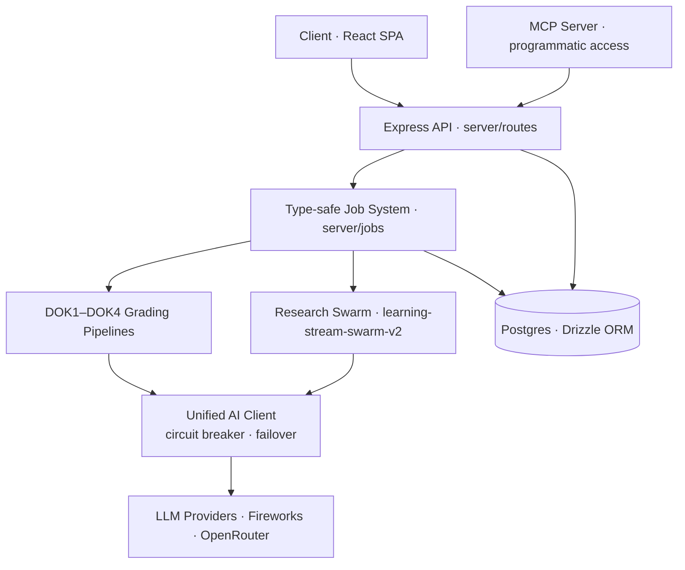

# Keystone

An AI learning platform that turns students into experts by making them do the thinking.
Underneath the product is a multi-agent orchestration platform: a governed runtime tool/skill registry, an MCP server, and a provider-agnostic AI client with a circuit breaker and automatic failover.
Published publicly as a portfolio reference.
**View-only — all rights reserved. See [LICENSE](LICENSE).**

> **Full technical documentation lives in [`docs/DEEP-DIVE.md`](docs/DEEP-DIVE.md).** This README is the overview; the deep dive covers every subsystem in detail.

## ▶ If you're evaluating my agent / AI-infrastructure work, start here

The strongest engineering is in these paths:

- **Multi-agent research swarm** — orchestrator, per-agent cost tracking, streamed events: [`server/ai/learning-stream-swarm-v2/`](server/ai/learning-stream-swarm-v2)
- **Unified AI client** — provider-agnostic model calls with a circuit breaker and automatic failover: [`server/ai/client/`](server/ai/client) · [`circuit-breaker.ts`](server/ai/client/circuit-breaker.ts) · [`registry.ts`](server/ai/client/registry.ts)
- **MCP server** — programmatic access to the platform for external agents: [`server/ai/learning-stream-swarm/mcp-server.ts`](server/ai/learning-stream-swarm/mcp-server.ts)
- **Type-safe background jobs** — the DOK1–DOK4 grading pipelines and research jobs: [`server/jobs/`](server/jobs)
- **Skills & tool registry** — runtime-loadable skills exposed to the chat agent: [`server/ai/chat/skills.ts`](server/ai/chat/skills.ts) · [`server/ai/chat/tools/`](server/ai/chat/tools)
- **Grader evaluation & monitoring** — how the LLM graders are kept honest: see [How I know the graders work](#how-i-know-the-graders-work)

### System at a glance



---

## What Keystone is

Most AI tools do the thinking for the learner. Keystone doesn't. It surfaces source material, asks questions that make students articulate their own understanding, and grades the depth of what they produce.

Each student builds a **Keystone Document**: a personal, source-grounded body of knowledge organized by the four levels of Depth of Knowledge (DOK). The platform surfaces sources through multi-agent research, verifies facts against evidence, and grades synthesis, insight, and conviction. It never generates the knowledge itself. The student has to.

That single rule — the student articulates the knowledge, the AI does not — is enforced in the system prompts, the tools, and the grading. The [Socratic method](docs/DEEP-DIVE.md) section of the deep dive shows exactly where and how.

### The DOK bright line

| Level | What it is | Who creates it | Platform role |
|-------|-----------|----------------|---------------|
| **DOK1 — Facts** | Objective, verifiable claims from sources | User extracts, AI assists | Verification, scoring, evidence fetching |
| **DOK2 — Summaries** | The user's own synthesis of DOK1 facts | User writes, no AI generation | Grading, source verification |
| **DOK3 — Insights** | Cross-source patterns the user constructs | User only | Guided Socratic discussion, full-pipeline grading |
| **DOK4 — Convictions** | Defensible positions where experts disagree | User only | Graded for divergence from a baseline LLM |

**DOK1–2 come from the external world; DOK3–4 come from the owner's expertise.** The platform surfaces the world and grades the thinking, but the student must supply the thinking. This constraint drives every AI interaction in the system.

## Agentic orchestration

Under the learning product sits the layer that decides what the agents can actually do: the capability layer, the standards for how tools are built, and the governance for how they ship. The pieces:

- **A governed tool and skill registry.** Chat tools are grouped by domain in [`server/ai/chat/tools/`](server/ai/chat/tools); 47 higher-level *skills* live in Postgres as first-class objects — permissioned, versioned, soft-deletable, shareable, and authorable from chat. Every write is validated (name format, description and body size caps, reference limits, path-traversal checks) before it ships. See [Runtime Skills Library](docs/DEEP-DIVE.md).
- **Context engineering by construction.** Skills load through three-level progressive disclosure — catalogue → body → references — so the whole registry costs almost nothing in context until a skill fires. A skill's trigger description is the only signal the orchestrating model uses to select it, so the authoring discipline treats it as a list of user-vocabulary triggers rather than a topic blurb.
- **Reliability under real providers.** All model calls route through one [unified AI client](server/ai/client) with per-call observability, a circuit breaker on the primary provider, and automatic failover to a mapped fallback tier. Background jobs are type-safe and non-throwing, and the LLM graders are continuously monitored for drift.
- **Programmatic access via MCP.** The whole platform is exposed to any MCP-compatible agent through a companion Cloudflare Worker with Google OAuth ([`keystone-mcp`](https://github.com/carolyn-beep/keystone-mcp), 17 tools) backed by a service-authenticated internal API.
- **Developer experience for tool authors.** New skills are created in-chat through a draft → review → save loop grounded in seeded references (a tool catalogue, a body template, and trigger-description patterns), so a new capability goes from idea to agent-invocable without platform-team involvement.

Each of these is documented in full in the [deep dive](docs/DEEP-DIVE.md).

## How a student uses Keystone

1. **Start with a question.** The student names something they want to master, and the agent helps frame a *purpose* for their Keystone Document.
2. **Gather raw material.** The research swarm fans out and surfaces real sources — articles, papers, transcripts — tailored to that purpose. Nothing is summarized yet.
3. **Extract verified facts (DOK1).** In a split-screen reader, the student pulls out checkable facts. Each is verified against evidence and scored.
4. **Synthesize in their own words (DOK2).** The Discussion Agent asks how the facts connect. The student writes the synthesis; the grader checks whether real reorganization happened.
5. **Find the insight (DOK3).** The student names a non-obvious pattern across sources. The agent refuses to name it for them.
6. **Take a position (DOK4).** The student commits to a defensible view on a contested question, graded for whether it actually diverges from what a generic AI would say.
7. **Defend it.** In Adversary Defense, the student defends that position against an escalating AI opponent across 12 rounds.

By the end, the student hasn't collected AI-generated notes. They've built, and can defend, a body of expertise that is their own.

---

## How I know the graders work

Grading students with an LLM is only trustworthy if the grader itself is measured. These mechanisms keep the graders honest:

- **Frozen monitoring corpus (5 documents)** — a fixed set of five brainlifts, re-graded against an unchanging baseline: [`freeze-grader-monitoring-set.ts`](server/services/freeze-grader-monitoring-set.ts)
- **Weekly dual-pass consistency run** — the frozen set is graded twice and compared with a Pearson correlation per DOK level, scheduled in the [`crontab`](server/jobs/crontab): [`run-weekly-grader-consistency.ts`](server/jobs/run-weekly-grader-consistency.ts)
- **Week-over-week model-drift tracking** — each run is diffed against the prior week's, so a model or provider swap that shifts grading gets caught (`/api/analytics/model-drift`)
- **Human-override recording** — human verification outcomes logged against LLM grades for calibration: [`analytics-dashboard.ts`](server/storage/analytics-dashboard.ts)
- **Append-only score-event history** — score events recorded with their triggers across pipeline checkpoints: [`analytics-score-events.ts`](server/services/analytics-score-events.ts)
- **LLM divergence check** — DOK4 positions graded against a baseline model's output: [`dok4Grader.ts`](server/ai/dok4Grader.ts)
- **Import-pipeline integrity** — every extraction validated for content loss and hallucinations before acceptance: [`preformat/validator.ts`](server/ai/preformat/validator.ts)
- **313 test files** (Vitest): [`vitest.config.ts`](vitest.config.ts)

---

## Architecture

```
client/           React 18 + TypeScript, TanStack Query, Tailwind, Framer Motion
server/
  routes/         Domain-based Express routers
  services/       Business logic, orchestration, grading pipeline
  storage/        Drizzle ORM, domain-split behind a facade
  ai/             LLM integrations (verification, DOK2–4 grading, linking, extraction)
    client/       Unified AI client — registry, providers, retry/timeout/failover
    chat/         Native chat adapter, system prompt, tool registry, skills
    learning-stream-swarm-v2/  Research orchestrator + per-type agents + cost tracking
  brand/          Per-brand system prompts + dispatcher
  jobs/           Graphile Worker background jobs
  prompts/        Structured grading prompts (DOK1–4)
shared/           Schema definitions, shared types, run contracts
migrations/       PostgreSQL migrations (Drizzle Kit)
features/         Living feature docs + per-spec research/spec/checklist artifacts
```

Four infrastructure decisions worth calling out (full detail in the [deep dive](docs/DEEP-DIVE.md)):

- **Storage facade.** The storage layer is split by domain but exposed through a single `storage` object, so every call site reads `import { storage } from '../storage'`. Adding a domain is one file and one line.
- **Type-safe background jobs.** A `withJob()` utility infers payload types from each job function's signature, and the job registry uses `as const`, so a wrong job name or payload shape is a build error, not a runtime surprise.
- **IDOR prevention at the storage layer.** Child resources are always fetched through `*ForBrainlift` functions that include `brainliftId` in the WHERE clause, so a single query both fetches and authorizes. Missing and unauthorized both return 404.
- **Unified AI client.** All LLM calls route through one client with per-call observability, a real circuit breaker on the primary provider, and automatic failover to a mapped fallback tier.

## How Keystone grades

Most automated grading checks whether an answer is right. Keystone grades how deeply the student understands. Each DOK level has its own pipeline, rubric, and core question, and each is built so a student can't fake depth by pattern-matching or pasting in AI output.

| Level | The question it grades | How |
|-------|------------------------|-----|
| **DOK1 — Facts** | *Is this actually true?* | Checked against fetched evidence (cited source first, web search fallback) and scored 1–5 by a multi-model verifier chain with provider failover. |
| **DOK2 — Synthesis** | *Did real reorganization happen?* | Graded on whether the summary synthesizes facts through the student's own lens rather than compressing them. Copy-paste scores 1; genuine synthesis 4–5. |
| **DOK3 — Insight** | *Can you see the framework?* | Must link ≥2 summaries from ≥2 sources, then graded on whether it reveals a conceptual lens built across sources. |
| **DOK4 — Conviction** | *Is it yours, and divergent enough?* | Tests borrowed divergence and non-divergence at once. A view scores high only if it diverges from what a baseline LLM confidently produces. |

Three principles run through all four pipelines: evidence over assertion (a weak foundation caps everything above it), grading depth rather than opinion (form and grounding, never whether a stance is "correct"), and feedback that names the gap and the evidence that would close it, then stops.

The full DOK1–4 pipelines, rubrics, and scoring math are documented in the [deep dive](docs/DEEP-DIVE.md).

## Selected systems

Each of these has a full section in the [deep dive](docs/DEEP-DIVE.md):

- **Research Stream** — an orchestrator reads the student's Keystone Document and Second Brain, then fans out per-source-type agents (academic, news, podcast, video, Twitter, web) in parallel, each verifying sources before saving. Cost is tracked per run against a monthly-refreshed price table.
- **Runtime Skills Library** — 47 database-backed skills the chat agent loads on demand through three-level progressive disclosure, so the catalogue costs almost nothing in context until a skill fires. Skills are permissioned, versioned, soft-deletable, and authorable from chat.
- **Native chat runtime** — an in-process AI SDK runtime with a `LanguageModelV2` adapter over OpenRouter, persisted conversations, and a domain-grouped tool registry (grading, skills, research, curation, sprint, structured ask-user).
- **Import & extraction** — imports from WorkFlowy, HTML, or Google Docs run through structural evaluation, an optional pre-formatting pipeline, and integrity validation (content-loss and hallucination checks) before the DOK grading pipeline.
- **MCP server & internal API** — the whole grading platform is exposed to any MCP-compatible agent through a companion Cloudflare Worker with Google OAuth ([`keystone-mcp`](https://github.com/carolyn-beep/keystone-mcp)), backed by a service-authenticated internal API.
- **Dual-brand deployment** — one codebase ships as two products (student and professional) selected by an env var at build time, with a post-build bundle grep proving the inactive brand is tree-shaken out.
- **Roadmap (specified, not yet shipped):** AI Adversary Defense (12-round adversarial expertise test) and Honcho (a persistent learner-profile layer). Both are documented in the deep dive and marked as roadmap.

## Tech stack

React 18 + TypeScript, TanStack Query, Tailwind, and Framer Motion on the client. Express, Drizzle ORM (PostgreSQL), and Graphile Worker on the server. LLM calls go through OpenRouter (primary) and Fireworks (failover) via the unified AI client, with Exa for search and content extraction.

---

## Development

```bash
# Install dependencies
npm install

# Start development (client + server + worker)
npm run dev

# Type check
npm run build

# Run tests (Vitest)
npm test            # one-shot (vitest run)
npm run test:watch  # watch mode

# Database migrations
npx drizzle-kit generate
docker exec -i wizardly_kalam psql -U postgres -d dok1grader_local < migrations/XXXX.sql
```

### Environment variables

| Variable | Purpose |
|----------|---------|
| `DATABASE_URL` | PostgreSQL connection string |
| `ANTHROPIC_API_KEY` | Claude API (discussions, extraction, orchestration, adversary, evaluation) |
| `OPENROUTER_API_KEY` | Primary text-generation provider for the unified AI client |
| `FIREWORKS_API_KEY` | Fireworks failover provider for the unified AI client and image fallback |
| `OPENAI_API_KEY` | Primary image-generation provider (`gpt-image-1`) |
| `EXA_API_KEY` | Exa search and Contents APIs (research swarm, chat web search, article extraction) |
| `YOUTUBE_API_KEY` | YouTube Data API (video researcher agent) |
| `SWARM_AGENT_COUNT` | Research agents per swarm (default: 5) |
| `WORKER_CONCURRENCY` | Background job concurrency (default: 3) |
| `BRAND` | Server brand selector. `keystone` or `brainlift`. Throws at boot if missing or unknown. |
| `VITE_BRAND` | Client brand selector. `keystone` or `brainlift`. Read at Vite config time to alias `@/brand`. Must match `BRAND`. |
| `VITE_BRAND_NAME` | Display name shown in the browser tab and HTML meta description (e.g. `Keystone` or `Keystone Central`). |
| `SWARM_VERBOSE_LOG` | Optional. `true` enables per-tool verbose file logging for research-stream runs. Default off. |
| `VITE_ENABLE_DEV_LOGIN` | Optional build-time flag. `true` keeps the Login page's "Dev quick login" panel visible on production builds. Default off in production. |
| `VITE_PROVIDERS_ADMIN_ALLOWLIST` | Optional. Comma-separated emails that see the "Providers" admin nav link in the client. Server routes stay protected by `requireAdmin` regardless. Default: none. |

## License

**Copyright (c) 2026 Carolyn Driscoll. All rights reserved.** This repository is published as a portfolio reference and work sample only, for viewing and evaluation. No rights to use, copy, modify, or redistribute the code are granted. See [LICENSE](LICENSE) for full terms. For any use beyond viewing, contact carolyn@carolyndriscoll.com.
